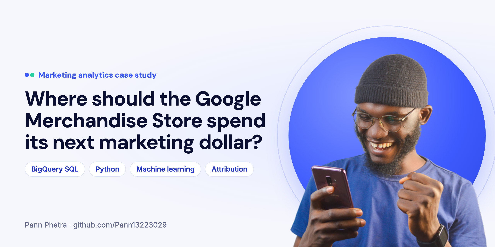
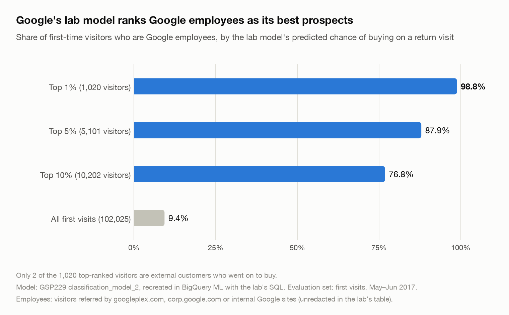
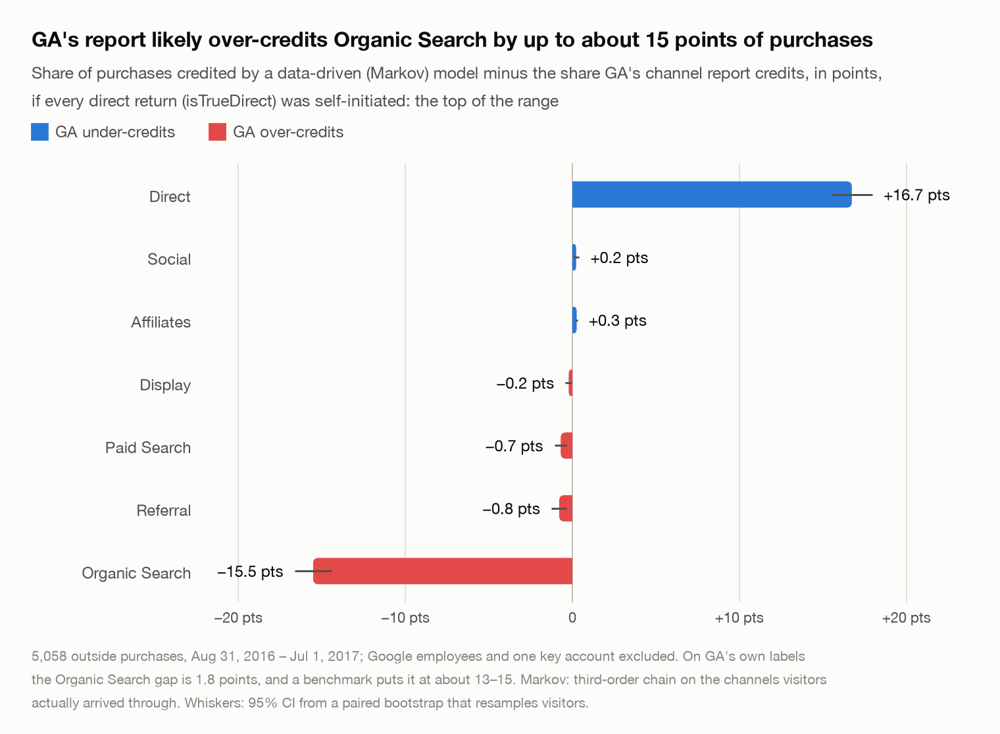
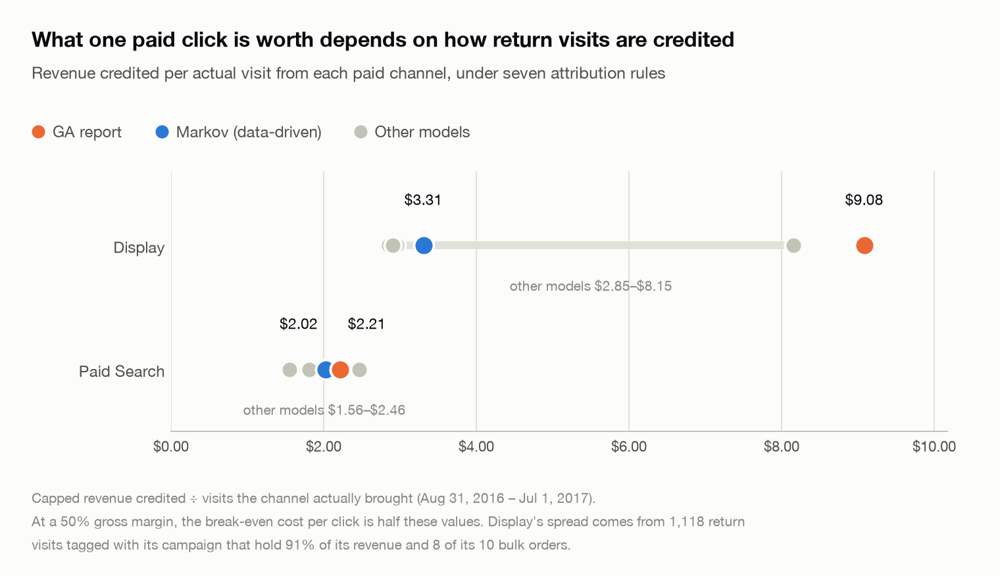
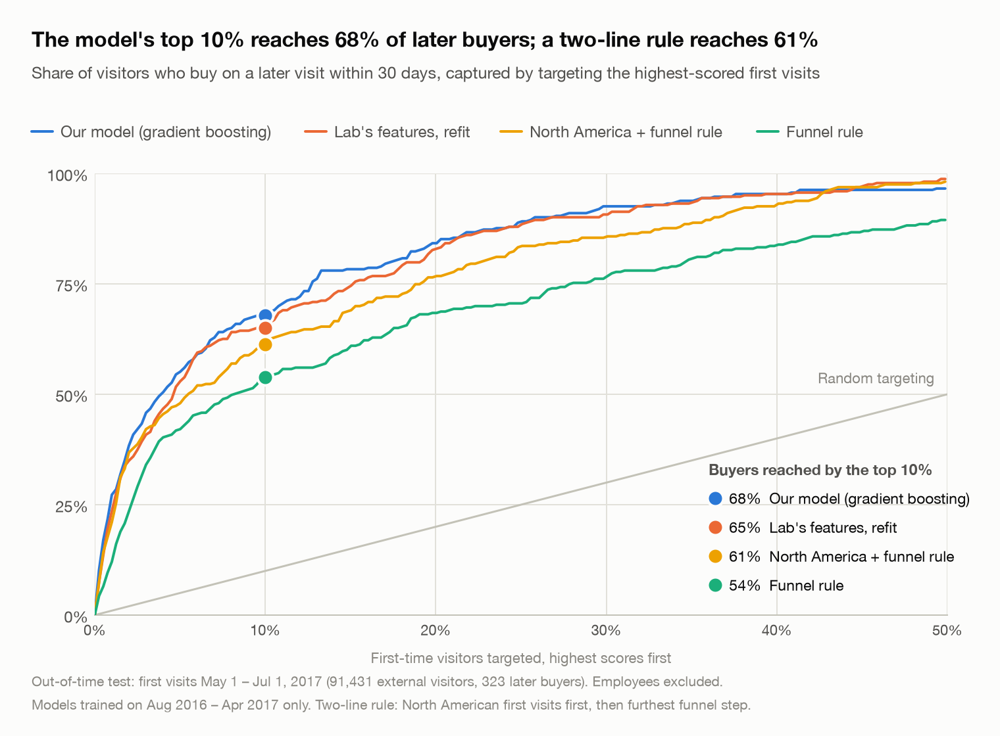

# 

Pann Phetra · [github.com/Pann13223029](https://github.com/Pann13223029)

BigQuery SQL · BigQuery ML · Python (pandas, scikit-learn, statsmodels) · Looker Studio

**Taken at face value, Google's online merch store runs on referral traffic. It doesn't.** 41% of its revenue comes from Google's own employees, clicking through from an internal link that the public data hides as "Referral". Google's own teaching lab on this data didn't catch it either: 98.8% of the "likely buyers" at the top of its model are Google staff.

That was the first surprise in a year of the store's analytics (Aug 2016 – Aug 2017, 903,653 visits in BigQuery). The two questions that matter to its marketing team, which channels deserve the budget and which visitors are worth paying to bring back, only made sense once those visitors were set aside.

## Why I did this

I start with the business problem, then solve it with whatever fits: product, data or AI. I co-founded an EdTech company, OpenMirai (one of five founders, leading strategy), worked as a business analyst at Opendream, and I'm finishing my degree at Ritsumeikan Asia Pacific University in Japan (March 2027).

In summer 2025 I was vice leader of a student shaved-ice stand at two festivals in Beppu. On night one we logged all 450 cups by hand, with each flavour and our best guess at each customer's age and group, and used the tally to rework the menu for night two. This project asks the same question at Google's scale: who is actually buying, and what should change?

It's also my capstone for the Google Data Analytics certificate, with a twist. Most projects on this dataset ask "will this visitor buy?". I asked the question the store's Head of Marketing has to answer instead, and I checked the Google lab that asks the first one.

## The short answer

| The Head of Marketing asks | My answer | How sure |
|---|---|---|
| **Which channels deserve the budget?** | Don't move money on GA's channel report: it likely gives Organic Search up to about 15 points of purchase credit that visitors returning on their own earned. Keep Paid Search, but bid below what a click can be worth ($0.78–$1.21 at most). Hold Display's budget until a test shows what it adds. | **Moderate** on Organic Search: the direction holds under every reading, but the size rests on an assumption. **Low** on what Paid Search and Display cause, which only a test can show |
| **Which first-time visitors are worth bringing back?** | Only the top-scored ones. A model's top 10% holds 71% of later buyers, but retargeting them is worth only about $700–$760 a month before ad costs. Measure the real lift with a 50/50 test. | **High** for the ranking. **Low** for the lift, which is borrowed from other companies' experiments |

There's no "move X% of budget to channel Y" here, on purpose. The data has no ad costs, and getting credit for a sale isn't the same as causing it, so moving money by credit could fund channels that didn't cause the sales. I sized the tests that would settle it instead ([notebook 06](notebooks/06_test_design.ipynb)).

→ **The one-page memo I'd hand the Head of Marketing:** [reports/00_executive_summary.md](reports/00_executive_summary.md)

→ **The 14-slide deck I'd present to them:** [reports/slides.pdf](reports/slides.pdf)

---

## What I found

### 1. The store's biggest "channel" was Google itself

In the public data, employee visits show up as Referral with the source hidden. Google's own training copy of the data shows where they came from: `mall.googleplex.com`, the internal employee store link. That let me check my employee filter against the truth: 99.2% of the visitors it flags really are employees, and it catches 98.2% of their purchases. Everything below leaves these visitors out, because no marketing budget buys an employee's order.

### 2. Google's teaching model fell for the same thing

Google's BigQuery ML lab, GSP229, teaches machine learning on this store's data by asking whether a first-time visitor will buy later. I rebuilt it from the lab's own SQL and got its published scores back. The model looks excellent, but mostly because 61% of the buyers it learns from are employees. 98.8% of its top 1% of "likely buyers" are Google staff, and of the 1,020 visitors it ranks highest, only 2 were outside customers who went on to buy. Fine for teaching; take internal traffic out before using a model like this to target anyone.



<details>
<summary>The numbers</summary>

- Recreated scores: 0.724 / 0.909, against the published 0.72 / 0.91.
- Employees are 61% of the training positives and 74% of the evaluation positives.
- Scored only on outside visitors, its ROC-AUC (how well it ranks buyers above non-buyers, from 0.5 for chance to 1) drops from 0.910 to 0.863: −0.047 (95% CI −0.059 to −0.035).
- Without the source, medium and channel features the gap disappears (0.885 / 0.882), but employees still fill 59–66% of the top 1% through location and engagement, so they have to leave the population, not just the features.
- A version trained without employees scores 0.877 on outside visitors.

</details>

### 3. GA's report gives Organic Search credit that returning visitors earned

When someone comes back by bookmark or by typing the address, GA's default report hands the sale to the last campaign they arrived from, such as an earlier Google search. I rebuilt the journeys behind 5,058 outside purchases and let a data-driven model share out the credit instead. It gives Organic Search 38.2% of purchases, not GA's 53.8%: about 15 points less, if every direct return was the visitor's own idea. Visitors coming back on their own bring 34% of purchases, and the report credits them to earlier campaigns.



<details>
<summary>The numbers</summary>

- The gap is 15.5 points (95% CI 14.4–16.6) if every direct return was self-initiated, 1.8 points on GA's own labels, and about 13–15 at a benchmark from how returning visitors behave. About 7 of the points are a lookback-window choice.
- Returning visitors bring 34% of purchases and 44% of capped revenue. First-ever visits that arrived direct add 19% and 20%.
- The model is a third-order Markov chain: it asks how many sales would disappear if a channel were removed from the journeys (a value-weighted removal effect), with a paired bootstrap that resamples visitors.

</details>

### 4. One office desktop made Display look like a winner

It visited the store 278 times, on weekdays during office hours. It had already placed a $17,860 order before it clicked a Display ad, once. GA remembers campaigns, so it labelled the account's next 15 purchases "Display": $110,553 from a customer who was already buying. That one account is 89% of everything GA credits to Display. I report it on its own, like employees. Without it, a Display click is credited with $2.84–$3.87 under every rule, and only a test can show what Display really adds.

<details>
<summary>The numbers</summary>

- The key account: 16 purchase sessions worth $128,413, 15% of outside revenue in the period and half of all bulk purchase revenue.
- Its only Display click was on Mar 10, 2017; the 15 purchases GA labelled Display followed from Mar 24 to Jun 30, all on return visits.

</details>

### 5. A Paid Search click is worth less than its credit suggests

Every attribution rule I tested credits a Paid Search click with $1.56–$2.43 of revenue. At a 50% margin, that makes $0.78–$1.21 the most a click is worth bidding, and only if every one of those sales needed the ad. Many probably didn't: all 65 Paid Search purchases with a readable keyword came from searches for the store or its brand, the searches least likely to need an ad. So I treat that value as a ceiling, not a profit.



<details>
<summary>The numbers</summary>

- The bid ceiling is $0.39–$0.61 if half of the sales needed the ad, and $0.19–$0.30 if a quarter did.
- 77% of Paid Search purchases have no readable keyword (162 on days the export blanked it, 55 from Dynamic Search Ads), so the brand share can't be measured in full.

</details>

### 6. A model can find tomorrow's buyers, but they're worth less than you'd hope

Scored at their first visit, the top 10% of first-time visitors held 71% of the outside customers who bought within the next 30 days. A two-line rule (North American visitors first, then how far they got toward checkout) reached 61%, so the model's edge is real but modest. And the money is small: retargeting the top 10% is worth about $700–$760 a month in extra gross profit, before ad costs.



*The chart shows the population as first reported (68% vs 61%). Scored without hindsight about who is an employee, the model reaches 71% of real later buyers.*

<details>
<summary>The numbers</summary>

- 71% has a 95% CI of 65–75%. The model was trained only on outside visitors, with a 30-day window, and tested once on months it never saw (May–Jun 2017).
- Nearly 1 in 4 of the later buyers the top 10% reaches are Google employees whom only a later visit reveals, so they count as reach, not value.
- The top 20% is worth about $930–$960 a month. PR-AUC is 0.062, against 0.028 for a funnel rule and 0.049 for the two-line rule.

</details>

## What I'd do on Monday

Four things can start now, two need a test first, and two are worth exploring.

| When | Action | Owner | At stake |
|---|---|---|---|
| Now | Report Google employees and the key account as their own segments | Web analytics | 41% of revenue (employees); $128k (key account) |
| Now | Show a multi-touch view beside GA's channel report, with the Organic Search range | Head of Marketing, Finance | Up to ~15 points of purchase credit |
| Now | Split brand from non-brand search, and keep bids under the value ceiling ($0.78–$1.21 at most) | Paid media | $1.56–$2.43 attributed per click |
| Now | Review any spend on YouTube promotion and affiliates | Paid media | ~98,000 YouTube visits in Oct–Nov 2016, no purchases; 9 affiliate sales all year |
| Test | Retarget only the top-scored first-time visitors, and measure the lift with a 50/50 holdout of the top 20% for 12 months | Retargeting lead | $700–$960 a month |
| Test | Hold Display's budget and run a 12-week 50/50 holdout measured on site visits | Paid media | Display's ~$17k of revenue a year |
| Explore | Retention: email and reminders for past visitors | Head of Marketing | 34% of purchases |
| Explore | A direct sales path for corporate (bulk) buyers | Head of Marketing, Sales | $248,552 of bulk purchase sessions, half of it one account |

## Where I got it wrong

Some mistakes I caught along the way. Each one is recorded in the decision logs:
- **I assumed Google's lab used the public dataset.** It uses a fuller table, so I redid the audit on the lab's own data, which turned an estimate of the employee share (53%) into a verified figure (61%).
- **An ID that looked unique wasn't.** The lab's `unique_session_id` repeats for visits split at midnight, and joining on it duplicated 1,666 rows. The join now uses a fingerprint of all grouping columns.
- **A memoryless model over-credited Social.** A first-order Markov chain gave Social nearly 3× the purchases its journeys produced. A third-order chain fixed most of it, and Social and Affiliates stay out of the headlines.
- **A revenue-splitting method I rejected** gave Paid Search less credit than last click. I replaced it with a value-weighted removal effect.
- **A two-day overlap flipped my model choice.** One tuning fold left only February, 28 days, between training and validation, but each label looks 30 days ahead, so labels from Jan 30–31 could see into the validation months. Fixing it moved gradient boosting just past the random forest (0.0705 vs 0.0700). My rule, set before testing, takes the higher score, so I switched, even though the headline dipped from 72% to 71%.

Then, before calling it done, I put the whole analysis through an AI-assisted red-team review: re-derive every headline from the data and hunt for claims the evidence doesn't support. It changed six conclusions:
- **Display** was mostly one corporate buyer, so it's now reported on its own as the key account.
- **Organic Search's over-credit** depends on how GA's direct-return flag is read, so it's now a range with moderate confidence. A check that had seemed to confirm it turned out to be an export-day artifact.
- **"Direct"** mixed visitors returning on their own with first-ever visits, so returning visitors get 34% of purchases, not the half I first reported.
- **The retargeting population** used later visits to leave out employees, which a live campaign can't see. Scored without that hindsight, the model still reaches 71% of real later buyers, and employees are 23% of the buyers it reaches.
- **Both proposed tests** were too small to detect their effects, so notebook 06 sizes designs that can.
- **Paid Search:** every purchase with a readable keyword was a brand search, so its value is now a ceiling, with scenarios for how many sales the ads caused.

## What I learned

- **Question the data before the model.** The biggest findings here came from asking who is in the data, not from a model: employees and one corporate buyer changed almost every channel number.
- **Credit isn't causation.** Attribution shows the paths people took, not what each channel caused, so the recommendations end in tests sized to detect a real effect.
- **Review early.** The red-team review changed six conclusions at the end. Next time I'd run smaller reviews at the start and halfway, before conclusions harden.
- **Start from the decision.** Framing the work around the Head of Marketing's two decisions told me which analyses mattered, and made "test it first" a legitimate answer.

---

## How I did it, for technical reviewers

D1 is the channel-budget decision and D2 the retargeting decision; H1–H4 are the hypotheses set in the Ask phase.

### Ask ([reports/01_ask.md](reports/01_ask.md))
The business task, stakeholders, 8 guiding questions, 4 hypotheses with pre-specified tests, and success criteria. The public dataset is heavily used, and Google's own lab already asks "will this visitor buy?", so the project is framed around **budget decisions** and around **auditing** that lab rather than repeating it.

### Prepare ([reports/02_prepare.md](reports/02_prepare.md) · [notebook 01](notebooks/01_prepare.ipynb))
- **Credibility and completeness:** a ROCCC credibility check and a field-by-field completeness review (city 56% redacted, campaign 97% unset, `timeOnSite` NULL means zero).
- **Employee traffic:** found as referral traffic with a hidden source, 66% of it from Google office cities.
- **Duplicates:** the 898 "duplicate" sessions turned out to be visits split at midnight.
- **Order values:** the top 1% of purchase sessions carry 29% of outside revenue, half of it one corporate account, so revenue is **capped per purchase session** and purchases count first.

### Process ([reports/03_process.md](reports/03_process.md) · [notebook 02](notebooks/02_process.ipynb))
- **One clean session table** from nested BigQuery data (`UNNEST` over hits for funnel steps), with 15 validation checks against raw totals, all passing. They catch dropped or duplicated rows; a unit-test suite covers the logic.
- **GA credit shifting:** 29% of outside purchases happen on return visits that GA credits to an earlier campaign. So attribution uses the channel visitors **actually arrived through**, and GA's own labels are kept as the baseline.

### Analyze ([reports/04_analyze.md](reports/04_analyze.md))
| Part | Notebook | Methods | Headline |
|---|---|---|---|
| **A. Audit of Google's lab (GSP229)** | [03](notebooks/03_analyze_lab_audit.ipynb) | Recreated the lab in **BigQuery ML** with its own SQL; unredacted ground truth; paired bootstrap; test with features removed to find the cause | H4 supported: employees inflate the published ROC-AUC by 0.047 (95% CI 0.035–0.059). On outside visitors the lab model scores 0.863, close to a version trained without employees (0.877) |
| **B. Retargeting model (D2)** | [04](notebooks/04_analyze_remarketing.ipynb) | χ² test, z-tests, logistic regression with odds ratios; logistic regression, random forest, and gradient boosting tuned with **time-based folds and an embargo**; one test on unseen months against two no-model rules; Wilson intervals; calibration and permutation importance; a re-evaluation without hindsight; break-even analysis | PR-AUC 0.062 vs 0.028 (funnel rule) and 0.049 (two-line rule); 71% of real later buyers in the top 10% vs 61% for the two-line rule; the top 10% is worth about $700–$760 a month |
| **C. Attribution (D1)** | [05](notebooks/05_analyze_attribution.ipynb) | Last-touch, first-touch, linear, and position-based models; a **third-order Markov chain** (order chosen by held-out likelihood) with a value-weighted removal effect; paired bootstrap that resamples visitors; a visitor-concentration check; an assumption dial with a benchmark; a Shapley decomposition | H2 holds against true last click but is reversed against GA's report. GA likely over-credits Organic Search by up to about 15 points; one key account held 89% of Display's reported revenue; a Paid Search click's value is a ceiling ($1.56–$2.43) |
| **D. Test design** | [06](notebooks/06_test_design.ipynb) | Power and minimum detectable effect for two-sample tests; Poisson power with variance inflation for weekly counts | A 50/50 holdout of the top 20% for 12 months detects a 14% purchase lift (a 10/90 split has 23% power at +10% after a year). A purchase-based Display holdout has 5–6% power, so Display is tested on site visits |

### Share
- **Executive summary** for the Head of Marketing: [reports/00_executive_summary.md](reports/00_executive_summary.md)
- **Slide deck:** 14 slides for presenting the findings, with the lab audit and methods as an appendix: [reports/slides.pdf](reports/slides.pdf)
- **Charts:** [reports/figures/](reports/figures/). Chart colors come from a validated palette, checked for color-blind separation.
- **Looker Studio dashboard:** a step-by-step build guide and its data in [dashboard/](dashboard/) (overview, channel credit, and an interactive break-even page with lift, margin, and cost controls).
- **Kaggle notebook:** a runnable, condensed version, [kaggle/merch_store_marketing_case_study.ipynb](kaggle/merch_store_marketing_case_study.ipynb), with publishing steps in [kaggle/](kaggle/).

## Reproduce it

**Prerequisites:** Python 3.12, the [gcloud CLI](https://cloud.google.com/sdk/docs/install), and a Google Cloud project with the BigQuery API enabled (a free [BigQuery sandbox](https://cloud.google.com/bigquery/docs/sandbox) project is enough).

```bash
python3.12 -m venv .venv && .venv/bin/pip install -r requirements.txt
gcloud auth application-default login                      # Google account with a free BigQuery sandbox project
gcloud config set project YOUR_PROJECT_ID
gcloud auth application-default set-quota-project YOUR_PROJECT_ID
```

Then run `notebooks/01` → `06` in order.
- **Downloads:** notebook 02's first run downloads the clean session table (0.81 GB scanned, about 8 minutes), and later runs read the local cache in `data/` (gitignored).
- **Committed results:** the BigQuery ML results (`data/raw/a11_*`, `a13_*`) and the tuning results (`data/processed/tuning_results.json`) are in the repository, so `RUN_BQML` (notebook 03) and `RUN_TUNING` (notebook 04) stay `False` by default. Set one to `True` to recompute: about 7 minutes for the BigQuery ML models, about 35 minutes for the tuning.
- **Run time** with `data/` filled: 01 and 02 under a minute each, 03 about 6 minutes (almost all of it paired bootstraps), 04 about 6–13 minutes, 05 about 4 minutes, 06 about a minute. A busy machine can take twice as long.
- **Cost:** every query stays well inside BigQuery's free tier. The query helper ([src/bq.py](src/bq.py)) dry-runs each query first, refuses anything scanning more than 20 GB, and caps each job's billed bytes at the same 20 GB. The BigQuery ML model-creation statements skip the dry run, which doesn't reliably estimate their cost, and run under that cap alone; they scan under 0.3 GB each.

**Tests:** the suite runs on synthetic data, with no BigQuery access; checks on the real journey table run only when `data/` is cached. CI runs it on every push.

```bash
.venv/bin/pip install -r requirements-dev.txt
.venv/bin/python -m pytest
```

```
├── reports/     executive summary, slide deck, phase write-ups (01_ask … 04_analyze), figures/
├── notebooks/   01_prepare … 06_test_design
├── sql/         prepare/ · process/ · audit/ (incl. the lab's BigQuery ML models)
├── src/         bq · validate · tables · segments · journeys · lab_audit · modeling · breakeven · attribution · power · viz · dashboard
├── tests/       pytest suite for the headline calculations
├── dashboard/   Looker Studio build guide and its CSV data (python -m src.dashboard)
├── kaggle/      self-contained Kaggle notebook
└── data/        local cache, rebuilt from sql/ (gitignored, except the BigQuery ML and tuning results)
```

## Limitations and ethics

- **Attribution isn't causal.** Attribution models describe the paths people took, not what each channel caused, and the retargeting lift is borrowed from published experiments. Notebook 06 sizes the holdout tests that would measure both.
- **Paid Search incrementality is unknown.** Its attributed value is a ceiling, and 77% of its purchases have no readable keyword, so the brand share can't be measured in full.
- **The key-account exclusion is a judgment.** It's documented (Analyze, Part C, decision D-C5), and the account is reported as its own segment rather than dropped.
- **Data gaps.** There's no ad-cost data, visitors are identified per device, and the data is 2016–17 Universal Analytics. The methods carry over to GA4's BigQuery export.
- **Margin.** The 50% gross margin is applied to revenue that includes tax and shipping, which overstates gross profit somewhat.
- **Privacy.** The data is anonymized by Google. Recommendations assume retargeting reaches only visitors who consented. The retargeting audience is 98% North American because that's where buyers are, and the report says so openly.

**Data:** Google Analytics 360 sample dataset (`bigquery-public-data.google_analytics_sample`) and the `data-to-insights.ecommerce.web_analytics` table used in Google's training labs, both published by Google for learning. **Code and write-ups:** [MIT license](LICENSE).

**Banner and deck cover photo:** Adeniji Abdullahi A on [Pexels](https://www.pexels.com/photo/a-happy-man-looking-at-a-cellphone-10843136/) (free Pexels license), background removed.
