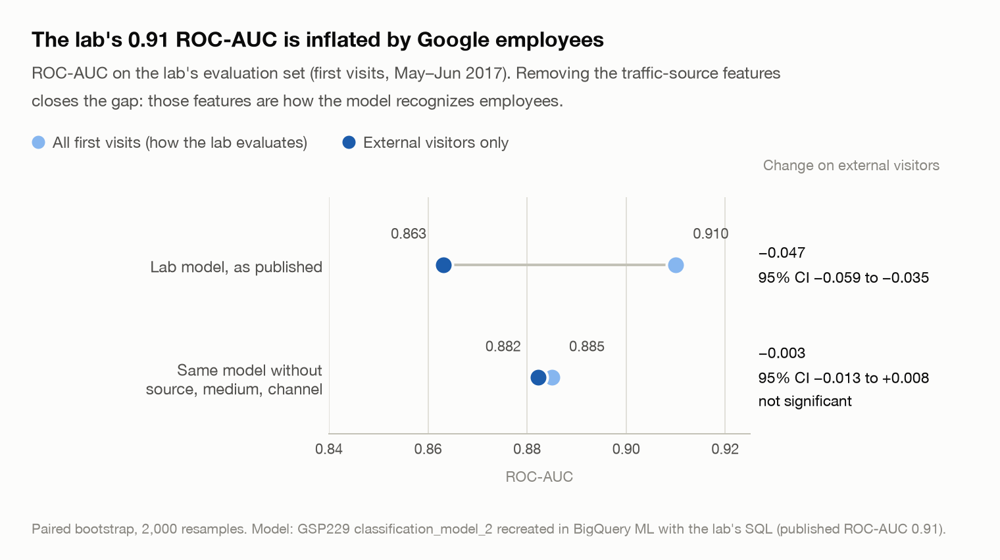
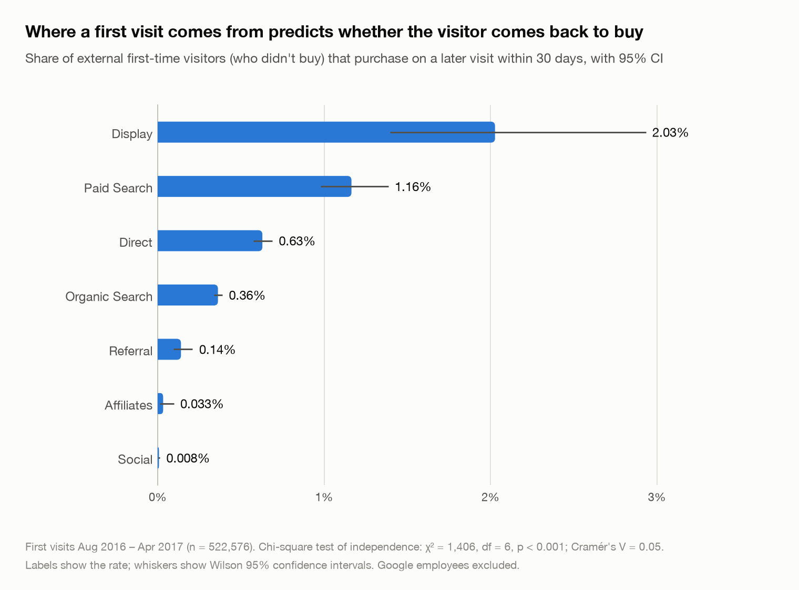
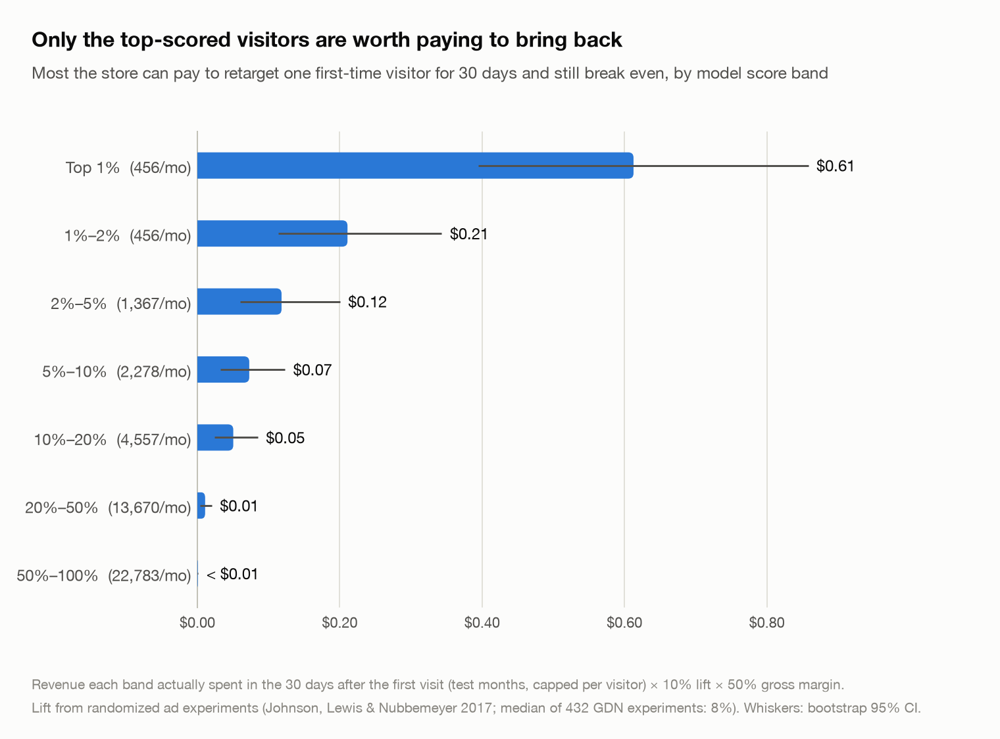
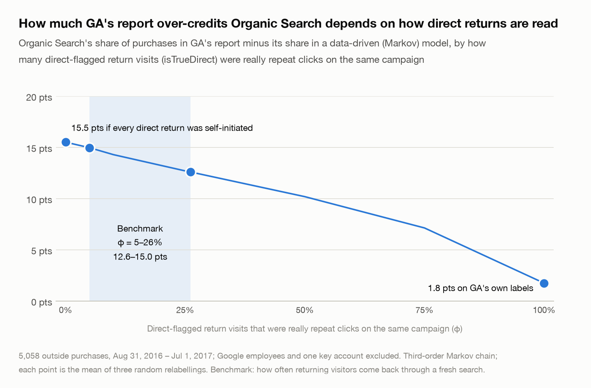
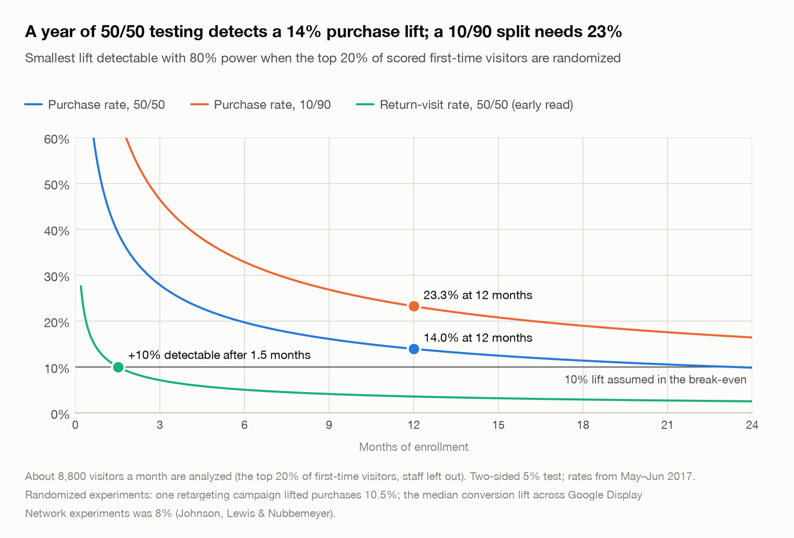

# Phase 4 — Analyze

- **Part A: Audit of Google's lab model for D2**
- **Part B: The corrected remarketing model and break-even audience (D2)**
- **Part C: Which channels deserve the credit: attribution and paid-click value (D1)**
- **Part D: Test designs for the two effects the data can't measure**

---

## Part A — Auditing Google's own model for this question (GSP229)

Notebook: [notebooks/03_analyze_lab_audit.ipynb](../notebooks/03_analyze_lab_audit.ipynb) · SQL: [`sql/audit/`](../sql/audit/)

Google's lab *Predict Visitor Purchases with a Classification Model in BigQuery ML* (GSP229) predicts `will_buy_on_return_visit` from a visitor's first visit and reports **ROC-AUC 0.91**. It's a teaching lab: it shows how to train and evaluate a classifier in BigQuery ML, not how to choose a retargeting audience. It answers nearly the same question as D2, though, so I audited what its published score means for a store that used it.

### Summary

| Finding | Evidence |
|---|---|
| The lab trains on a **different table** from the public sample | `data-to-insights.ecommerce.web_analytics`: 137,660 extra sessions, 13,314 extra purchase sessions, $3.0M extra revenue |
| That table **shows the referrer the public sample hides**, `mall.googleplex.com` | Plus `gdeals.googleplex.com`, `moma.corp.google.com`, and Google's internal Sites. This is ground truth for employee traffic |
| The Prepare-phase employee flag (public sample) is accurate | **99.2% precision**; catches **92.7%** of employee visitors and **98.2%** of their purchases. What it misses is about 1.5% of the purchases treated as external |
| **61% of the lab's training positives and 74% of its evaluation positives are Google employees** | Employees are only 5.9% / 9.4% of first visits |
| The lab's models **reproduce exactly** in BigQuery ML with the lab's own SQL | Model 1: 0.724 (published 0.72). Model 2: 0.909 (published 0.91) |
| **H4 supported:** the published ROC-AUC is inflated by employees | 0.910 on all first visits vs **0.863** on external visitors. Gap **0.047**, 95% CI 0.035 to 0.059 |
| The traffic-source features explain the gap, but **removing them doesn't clear employees from the top** | Without source, medium, and channel the gap disappears (0.003, 95% CI −0.008 to +0.013), yet employees still fill 59–66% of the top 1% of both audit variants |
| **The model's top prospects are employees** | Top 1% of first visits: **98.8% employees**; only **2 of 1,020** are external visitors who went on to buy |
| **On external visitors it ranks about as well as a clean version** | ROC-AUC 0.863 vs **0.877** when trained without employees (+0.014, 95% CI +0.011 to +0.017: real but small); precision in the top 1% 6.8% vs 6.4% |
| **Verdict:** fine for teaching; remove internal traffic before targeting | The published 0.91 overstates what the model does for a store, and its best-ranked prospects are the store's own staff |

### 1. The lab's table is not the public sample

| Sessions matched on `(fullVisitorId, visitId, visitStartTime)` | Sessions | Purchase sessions | Revenue |
|---|---:|---:|---:|
| In both tables | 832,872 | 10,642 (identical in both) | $1.63M (identical within $40) |
| Only in the lab's table | 137,660 | 13,314 | $2.99M |
| Only in the public sample | 70,781 | 910 | $0.15M |

Where the tables overlap, they agree. The lab-only sessions include 36,968 from internal Google referrers (7,213 purchases, $1.59M) and 31,300 Direct sessions converting at 15.5%, which looks like employees returning by bookmark. The public sample appears to be a version of the data with internal referrers redacted and much internal traffic removed. Since the lab trains on its own table, the audit uses that table.

### 2. Ground truth for employee traffic

In the lab's table, the top Referral source is **`mall.googleplex.com`** (79,767 sessions, 7,556 purchases, $1.19M). Other internal hosts include Google's internal Sites discount page (`sites.google.com/a/google.com/…`, 1,967 purchases), `gdeals.googleplex.com` (1,853), and `moma.corp.google.com`, Google's intranet (572), plus about 30 small corp tools.

**Ground-truth rule:** a visitor is internal if any of their sessions in the lab's table came from `*.googleplex.com`, `*.corp.google.com`, other internal Google tool hosts, the employee perks site, or `sites.google.com/a/google.com/…`.

**The Prepare-phase inference, checked against it** (public-sample visitors that also appear in the lab's table):

| | Visitors | Purchase sessions |
|---|---:|---:|
| Flagged, truly internal | 34,225 | 5,058 |
| Flagged, truly external | 291 | 11 |
| Not flagged, truly internal | 2,711 | 94 |
| **Precision / recall** | **99.2% / 92.7%** | **99.8% / 98.2%** |

Among flagged sessions that also appear in the lab's table, 249 came from `googleweblight.com`, a public Google mobile proxy that the public sample also redacts. That is one source of false positives. The misses are employees who never arrived through the redacted internal referral in the public sample. Together they are **about 1.5% of the purchases treated as external**, too small to change any conclusion. The flag stays as it is (decision D-A1).

### 3. Who the lab learns from

| Lab split | First visits | Positives | Positive rate | **Positives who are employees** | Employees among all first visits |
|---|---:|---:|---:|---:|---:|
| Train (2016-08-01 – 2017-04-30) | 573,001 | 8,771 | 1.53% | **5,313 (60.6%)** | 5.9% |
| Eval (2017-05-01 – 2017-06-30) | 102,025 | 1,650 | 1.62% | **1,218 (73.8%)** | 9.4% |

(Prepare had estimated 53% from the public sample. The lab's own table, with ground truth, gives 61%.)

### 4. Replication

The lab's SQL ran unchanged (apart from the dataset name) in the sandbox project's `lab_audit` dataset:

| Model | Features | Published ROC-AUC | **My BigQuery ML run** | scikit-learn replica |
|---|---|---:|---:|---:|
| `classification_model` | bounces, time on site | 0.72 | **0.724** | 0.751 |
| `classification_model_2` | + funnel progress, pageviews, source, medium, channel, device, country | 0.91 | **0.909** | 0.919 |

BigQuery ML reproduces both published values, so every headline number below comes from the lab's actual model. The scikit-learn replica fits to convergence where BigQuery ML's default optimizer stops early, which explains its gap on model 1. It's kept as a portable version (for example, for Kaggle) and shows the same pattern.

### 5. H4: the published ROC-AUC is inflated by employees

| Model (BigQuery ML) | ROC-AUC, all first visits | ROC-AUC, external only | Gap (paired bootstrap, 2,000 resamples) |
|---|---:|---:|---|
| Lab model, as published | 0.910 | 0.863 | **0.047** (95% CI 0.035 to 0.059); no resample ≤ 0 |
| Without source, medium, channel | 0.885 | 0.882 | 0.003 (95% CI −0.008 to +0.013); not significant |

**H4 is supported**, and the second row shows the mechanism: the internal referrers are values of `source`, so the traffic-source features let the model recognize employees and score them highly.

### 6. Who the lab model would target

| Lab model's ranking | Visitors | Employees | Buyers | …of which external |
|---|---:|---:|---:|---:|
| Top 1% | 1,020 | **98.8%** | 158 | **2** |
| Top 5% | 5,101 | 87.9% | 818 | 43 |
| Top 10% | 10,202 | 76.8% | 1,153 | 112 |
| All first visits | 102,025 | 9.4% | 1,650 | 432 |

A remarketing audience taken from the model's top ranks would be spent almost entirely on Google's own staff.

The two audit variants still put employees in 59–66% of their top 1%, because employees also browse deeply and add to cart. **Removing features isn't enough; employees must be removed from the population.**

### 7. How well each model ranks real customers

| Model (BigQuery ML), external visitors only | ROC-AUC | PR-AUC | Precision in top 1% | Lift in top 10% | ROC-AUC vs lab model (paired bootstrap) |
|---|---:|---:|---:|---:|---|
| Lab model, as published | 0.863 | 0.036 | 6.8% | 5.8× | — |
| Without source, medium, channel | 0.882 | 0.043 | 6.7% | 6.1× | +0.019 (95% CI +0.007 to +0.031) |
| Trained on external visitors only | 0.877 | 0.038 | 6.4% | 6.2× | +0.014 (95% CI +0.011 to +0.017) |

On external visitors, the lab model ranks about as well as its two variants. Their ROC-AUC gains are statistically significant but small, their PR-AUC is similar, and the lab model has the highest precision in its top 1%. So employees mainly inflate the *published* score. The practical damage is who ends up at the top of the list (§6), which only removing employees from the population fixes. Even at its best, more than 9 of every 10 visitors in the top 1% don't buy (base rate 0.47%). That's why D2 is judged on PR-AUC, lift, and a break-even cutoff, not ROC-AUC.

### Carried into Part B (D2)

1. **Population:** external visitors only. This is already the case in `remarketing_table`, and the flag is validated above.
2. **Evaluation:** PR-AUC and top-decile lift on external visitors in an out-of-time test, plus a break-even cutoff.
3. **Traffic-source features:** used only as channel groups fit on external data, and checked for stability.
4. **Baseline to beat:** the lab's feature set, refit on the corrected table and label, so the comparison uses the same population and the same 30-day label.

### Limitations

- **Ground truth depends on referrers.** Employees who never arrived through an internal referrer (for example, those who typed the URL) count as external in both tables, so the external-only results still contain some employees. The true inflation is probably *larger* than 0.047.
- **Google doesn't document how either table was produced.** The comparison shows *what* differs, not *why*.
- **The lab's label has no fixed time window**, so evaluation visitors from late June 2017 had less time to return. This affects all models equally, so the comparisons still hold.
- BigQuery ML models live in the sandbox project (`merch-store-capstone.lab_audit`). The notebook reads their committed results in `data/raw/` unless `RUN_BQML = True`.

### Decision log

| ID | Decision | Why |
|---|---|---|
| D-A1 | Keep the inferred public-sample flag (Referral + `(direct)` + `/`) for D1 and D2; don't switch to the lab's table | Verified at 99.2% precision and 98.2% recall of employee purchases. What it misses is about 1.5% of external purchases. The public sample stays the documented, citable dataset |
| D-A2 | Audit the lab on **its own table** with the **referrer ground truth**, recreating its models in BigQuery ML with its own SQL | An exact replication (0.724 / 0.909 vs 0.72 / 0.91) makes the audit about the real model, not an approximation |
| D-A3 | Join model predictions on a fingerprint of all GROUP BY columns, not the lab's `unique_session_id` | The lab's ID isn't unique (sessions split at midnight). Joining on it duplicated 1,666 rows |
| D-A4 | Judge GSP229 as a teaching lab: what its published score means for a store. Don't compare how well its score detects employees with how well it predicts purchases | The employee label comes from the same `source` field the model uses, so that comparison is circular |

---

## Part B — The corrected remarketing model (D2)

Notebook: [notebooks/04_analyze_remarketing.ipynb](../notebooks/04_analyze_remarketing.ipynb) · Code: [`src/modeling.py`](../src/modeling.py), [`src/breakeven.py`](../src/breakeven.py)

**Question:** which first-time visitors are worth paying to bring back?
**Population:** external first-time visitors who didn't buy on that visit.
**Label:** a purchase on a later visit within 30 days.
**Data:** train on first visits Aug 2016 – Apr 2017 (522,599 visitors, 1,433 later buyers, 0.27%); test once on first visits May 1 – Jul 1, 2017 (91,431 visitors, 323 later buyers, 0.35%).

### Summary

| Finding | Evidence |
|---|---|
| **H1 supported:** the first visit's channel predicts a later purchase | χ² = 1,406, df = 6, p < 0.001. Paid Search 1.16% and Display 2.03% vs Social 0.008% (about 150–270×) |
| **H3 supported in part:** adding to cart matters; viewing a product has no clear independent effect once engagement is controlled | Add-to-cart odds ratio **3.7** (95% CI 3.2–4.3); product view 1.16 (95% CI 0.995–1.36). North America **15.7**, mobile 0.36 |
| The model **clearly beats the funnel rule** (the Ask-phase success criterion) | PR-AUC **0.061 vs 0.028** (+0.032, 95% CI +0.019 to +0.048); top-decile lift **7.0× vs 5.4×** |
| **A two-line rule gets most of the way** | North American first visits first, then funnel step: PR-AUC 0.049, 61.3% of later buyers in its top 10%. Forest edge: top-10% share +8.7 pts (+4.4 to +13.5); PR-AUC +0.011 (−0.002 to +0.025), not significant |
| It only **slightly beats the lab's features refit on corrected data** | PR-AUC +0.005 (not significant); top-10% share +5.0 pts (+1.2 to +8.5). **Fixing the data mattered more than the model** |
| **The top 10% of first visits hold 70.0% of later buyers** (95% CI 64.8–74.7%); none are in the bottom 40% (at most 1.2%) | The two-line rule's bottom 40% is also empty |
| **Without hindsight: 72.1% of real later buyers** | The whole-year employee flag hid 544 test-month first-time visitors (83 later buyers). Scoring them anyway, as a live campaign must: 233 of 323 real buyers in the top 10% (67.0–76.7%) vs 60.7% for the two-line rule; staff are 22% of the buyers reached |
| Results are **robust** | Embargoed training 0.058; without missed employees 0.061; well calibrated (predicted 0.34% vs observed 0.35%) |
| **Retargeting is worth little beyond the top 20%** | Max affordable cost per visitor: top 1% **$0.70**, 1–2% $0.18, 2–5% $0.11, 5–20% $0.07, below that < $0.01 |
| **The prize is modest** | Top 10% (about 4,600 visitors/month) ≈ **$709/month** ($738 with staff at zero lift); top 20% ≈ $1,025. Across the assumptions, $213–$1,985 and $308–$2,871 |
| **The lift can be measured, but only with a 50/50 holdout** | Part D: the top 20% for 12 months detects a lift of 13.6% or more; a 10/90 split has at most 24% power at +10% within a year |

### 1. Hypotheses (training months only)

**H1: return-purchase rate by first-visit channel**

| Channel | First visits | Later buyers (30 days) | Rate (95% CI) |
|---|---:|---:|---|
| Display | 1,332 | 27 | 2.03% (1.40–2.93%) |
| Paid Search | 10,736 | 125 | 1.16% (0.98–1.39%) |
| Direct | 74,248 | 467 | 0.63% (0.58–0.69%) |
| Organic Search | 213,473 | 773 | 0.36% (0.34–0.39%) |
| Referral | 16,441 | 23 | 0.14% (0.09–0.21%) |
| Affiliates | 9,143 | 3 | 0.03% (0.01–0.10%) |
| Social | 197,203 | 15 | 0.008% (0.005–0.013%) |

Chi-square test of independence: χ² = 1,406, df = 6, p < 0.001. One of 14 cells has an expected count below 5 (3.7), which is within Cochran's rule. Cramér's V = 0.05 looks negligible, but V is capped by the base rate when the outcome is this rare, so the relative risks above describe the effect better. The Ask phase named V as the effect size; the switch to relative risks came after seeing the result, and the Ask decision log records it. **Social sends 38% of first-time visitors but only 1% of later buyers.**

**H3: product-level engagement on the first visit**

| First-visit engagement | Later purchase rate if yes | …if no | Ratio | One-sided z-test |
|---|---:|---:|---:|---|
| Viewed a product | 1.57% | 0.13% | 11.9× | z = 59, p < 0.001 |
| Added to cart | 3.59% | 0.17% | 21.1× | z = 81, p < 0.001 |

A multivariable logistic regression (522,576 first visits, McFadden pseudo-R² 0.27) holds engagement, channel, device, and region constant:

| Factor (vs reference) | Odds ratio (95% CI) |
|---|---|
| North America (vs rest of world) | **15.7** (12.4–19.8) |
| Added to cart | **3.7** (3.2–4.3) |
| Display / Direct / Paid Search (vs Organic Search) | 2.4 / 1.8 / 1.7 |
| Reached checkout | 1.9 (1.5–2.2) |
| log(pageviews), log(time on site) | 1.33, 1.23 per unit |
| Viewed a product | 1.16 (0.995–1.36), p = 0.06: **no clear independent effect** |
| Mobile / tablet (vs desktop) | 0.36 / 0.41 |
| Referral / Affiliates / Social (vs Organic Search) | 0.55 / 0.17 / 0.11 |

**H3 holds for adding to cart. Viewing a product has no clear independent effect** once engagement is controlled (odds ratio 1.16, 95% CI 0.995–1.36): its effect in the simple comparison came mostly from general engagement.

### 2. Model development

- **Validation:** three expanding-window folds inside the training months. Each skips a calendar month between training and validation (an embargo), because training labels look 30 days ahead. Fold 3's embargo is February, 28 days (see Limitations).
- **Selection rule, fixed before testing:** the highest mean validation PR-AUC.
- **Search:** 28 configurations. The first grid's best tree models sat at the grid's edge, so it was extended until the optima were interior.

| Candidate | Best settings | Validation PR-AUC | Per fold |
|---|---|---:|---|
| **Random forest** (chosen) | 300 trees, min leaf 10, √features | **0.0706** | 0.060 / 0.066 / 0.086 |
| Gradient boosting | lr 0.02, 4-leaf trees, min leaf 1,000, 300 rounds | 0.0701 | 0.059 / 0.068 / 0.083 |
| Logistic regression | L2, C = 0.01, log counts + one-hot | 0.0673 | 0.060 / 0.065 / 0.077 |
| *Baseline: lab's features, refit* | GSP229 features, unregularized logistic | *0.0560* | |
| *Baseline: two-line rule* | North American first visits first, then furthest funnel step, then pageviews | *0.0467* | |
| *Baseline: funnel rule* | Furthest funnel step, then pageviews | *0.0277* | |

Boosting improves as trees get *smaller* down to 4 leaves, while 2-leaf stumps are worse. The signal is **mostly additive with small interactions**, which is why logistic regression comes close. The random forest and boosting models are tied within fold noise. The rule picks the forest, and logistic regression is kept as the **explainer** (its odds ratios are in §1).

### 3. Test results (evaluated once)

Two baselines need no model at all. The **funnel rule** ranks first visits by the furthest funnel step they reached, then by pageviews; beating it is the Ask-phase success criterion. The **two-line rule** puts North American first visits first, then applies the funnel rule. It encodes the two strongest signals of the H3 regression, region and how far the visit got, so it's the benchmark to beat.

| Model | PR-AUC (95% CI) | ROC-AUC | Precision, top 1% | Lift, top 1% / 5% / 10% | Later buyers in top 10% |
|---|---|---:|---:|---:|---:|
| Funnel rule | 0.028 (0.021–0.042) | 0.806 | 4.3% | 12.1× / 8.4× / 5.4× | 53.9% |
| Two-line rule | 0.049 (0.037–0.070) | 0.880 | 7.4% | 21.1× / 9.5× / 6.1× | 61.3% |
| Lab's features, refit | 0.055 (0.042–0.077) | 0.901 | 8.3% | 23.5× / 10.6× / 6.5× | 65.0% |
| Gradient boosting | 0.062 (0.048–0.086) | 0.902 | 9.6% | 27.3× / 11.0× / 6.8× | 67.8% |
| Logistic regression | 0.063 (0.048–0.085) | 0.912 | 8.9% | 25.1× / 11.0× / 7.0× | 69.7% |
| **Random forest (chosen)** | **0.061** (0.047–0.082) | 0.912 | 9.6% | 27.3× / 10.8× / **7.0×** | **70.0%** |

| Random forest minus… (paired bootstrap, same test visitors, 2,000 resamples) | PR-AUC (95% CI) | Share of later buyers in the top 10% (95% CI) |
|---|---|---|
| Funnel rule | **+0.032** (+0.019 to +0.048) | **+16.1 pts** (+12.0 to +21.1) |
| Two-line rule | +0.011 (−0.002 to +0.025): not significant | **+8.7 pts** (+4.4 to +13.5) |
| Lab's features, refit | +0.005 (−0.008 to +0.018): not significant | **+5.0 pts** (+1.2 to +8.5) |

The model clearly beats the funnel rule, so the Ask-phase criterion is met. **Against the two-line rule the edge is much smaller:** the rule's top 10% holds 61% of later buyers against the forest's 70%. That gap is significant; the PR-AUC gain isn't. Against the lab's features refit on corrected data the gain is small too (70% vs 65%). The three model families are tied on the test months, and the validation winner isn't the test winner, which is what noise looks like when the real differences are small. **The large gain came from correcting the population and the label** (Part A and Process). The model mainly adds a sharper top of the ranking.

### 4. Robustness

| Check | Test PR-AUC | Lift, top 10% |
|---|---:|---:|
| Main result | 0.061 | 7.0× |
| Trained only on first visits through 2017-03-31, so no training label overlaps the test months | 0.058 | 6.8× |
| Without the 298 test visitors the lab's table identifies as employees the flag missed | 0.061 | 7.0× |

Calibration: mean predicted 0.34% vs observed 0.35% (Brier 0.0034). Predicted and observed rates agree by decile, and deciles 7–10 have no later buyers.

**How precise are the headline shares?** 226 of the 323 later buyers (70.0%) rank in the top 10%, 95% Wilson interval 64.8–74.7%. None rank in the bottom 40%, so with 95% confidence at most 1.2% of later buyers (about 4) sit there. The empty bottom 40% isn't special to the model: the two-line rule also leaves no later buyer there (0.6 expected if its tied scores were ordered at random), while the funnel rule leaves 29 (9.0%).

A bigger question is the employee flag itself, which uses hindsight. §8 re-runs the evaluation without it.

### 5. What drives the score

Permutation importance (drop in test PR-AUC when an input is shuffled): **country 0.013, sub-continent 0.010**, furthest funnel step 0.007, **operating system 0.007**, add-to-cart 0.005, channel 0.004, device 0.003, time on site 0.003. Correlated engagement counts share credit, so each looks small alone.

The operating-system signal is real. Within North America, Mac first visits come back to buy at 1.5% and Chrome OS at 1.2%, against 0.7% on Windows and 0.3–0.4% on phones. The employees the flag missed lean toward Macs but are only about 1% of buyers, too few to explain it.

### 6. Who would be in the audience (ethics check)

| Top 10% by score vs all first-time visitors | Top 10% | All |
|---|---:|---:|
| Northern America | 91.1% | 41.9% |
| Desktop | 81.5% | 61.8% |
| Paid Search / Direct | 12.1% / 32.0% | 3.8% / 21.9% |
| Social | 1.4% | 6.4% |

The audience follows purchase behavior: visitors outside North America almost never come back to buy, perhaps because of shipping or pricing, which the data can't show. In practice it's a **geographically narrow audience**, and the recommendation should say so openly. The low mobile share points to a mobile-experience question for the Act phase.

### 7. Break-even (decision D-B2)

> Remarketing pays off when revenue per visitor (next 30 days) × incremental lift × gross margin ≥ cost per visitor.

Revenue per visitor is **measured**: what each score band actually spent in the 30 days after the first visit, in the test months, capped per visitor at $1,606. Central assumptions are **10% lift** and **50% margin**. The lift is anchored on randomized experiments: a display-retargeting campaign lifted purchases 10.5% ([Johnson, Lewis & Nubbemeyer 2017](https://journals.sagepub.com/doi/abs/10.1509/jmr.15.0297)), and the median conversion lift across 432 Google Display Network experiments was 8% ([Johnson, Lewis & Nubbemeyer](https://papers.ssrn.com/sol3/papers.cfm?abstract_id=2701578)). Margin isn't public, so it's varied from 30% to 70%.

| Score band | Visitors/month | 30-day buy rate | Revenue per visitor (95% CI) | Max affordable cost/visitor: central (range across lift 5–20%, margin 30–70%) |
|---|---:|---:|---|---|
| Top 1% | 456 | 9.6% | $14.07 ($8.93–$20.62) | **$0.70** ($0.21–$1.97) |
| 1–2% | 456 | 3.6% | $3.59 ($1.68–$5.94) | $0.18 ($0.05–$0.50) |
| 2–5% | 1,367 | 2.0% | $2.24 ($1.14–$3.78) | $0.11 ($0.03–$0.31) |
| 5–10% | 2,278 | 1.1% | $1.35 ($0.71–$2.30) | $0.07 ($0.02–$0.19) |
| 10–20% | 4,557 | 0.58% | $1.39 ($0.74–$2.17) | $0.07 ($0.02–$0.19) |
| 20–50% | 13,670 | 0.14% | $0.09 | < $0.01 |
| Bottom 50% | 22,783 | 0.01% | $0.01 | ≈ $0 |

| Target | Visitors/month | Later buyers reached | Revenue per visitor | Extra gross profit/month before ad cost: central (95% CI) | Range across lift 5–20%, margin 30–70% |
|---|---:|---:|---:|---|---|
| Top 1% | 456 | 27% | $14.07 | $320 ($203–$470) | $96–$897 |
| Top 5% | 2,279 | 54% | $4.87 | $555 ($401–$747) | $167–$1,555 |
| Top 10% | 4,557 | 70% | $3.11 | **$709** ($523–$910) | $213–$1,985 |
| Top 20% | 9,113 | 86% | $2.25 | **$1,025** ($779–$1,292) | $308–$2,871 |

**Scope.** $709 a month is the value of the **top 10%** (about 4,600 visitors a month), not of retargeting in general. Widening to the top 20% (about 9,100 a month) raises it to about $1,025. The intervals cover sampling noise only; the assumed lift and margin matter more. Either way, retargeting is worth hundreds to low thousands of dollars a month before ad costs, not a major budget line. The bottom half of scored visitors produced 5 later buyers out of 45,715.

### 8. The audience without hindsight (decision D-B5)

The population above leaves out Google employees with a **whole-year** flag: a visitor is internal if any session in the year arrives through the internal link. For a first-time visitor, that flag is often set by a *later* session, which a live campaign can't see when it scores the first visit. `remarketing_table(sessions, internal_flag="first_visit")` rebuilds the table with only what's knowable at scoring time, and the chosen forest is refit on it in the same way.

**Staff** are the visitors this adds back: flagged as employees only by a later session. They stay in the ranking, because nobody can remove them at scoring time. They can be identified afterwards, though, so their purchases don't count as successes and the break-even values them at zero.

| | Visitors | Later buyers | Staff | Staff later buyers | Staff 30-day buy rate | Everyone else's |
|---|---:|---:|---:|---:|---:|---:|
| Whole year | 616,917 | 2,217 | 2,887 | 461 (20.8%) | 16.0% | 0.29% |
| Test months | 91,975 | 406 | 544 | 83 (20.4%) | 15.3% | 0.35% |

| Test months | As reported | No hindsight: all later buyers | No hindsight: real later buyers (staff not counted) |
|---|---:|---:|---:|
| Later buyers | 323 | 406 | 323 |
| PR-AUC | 0.0607 | 0.0779 | 0.0583 |
| Top 1%: recall / precision | 27.2% / 9.6% | 25.1% / 11.1% | 25.1% / 8.8% |
| Top 10%: recall / precision | 70.0% / 2.5% | 73.9% / 3.3% | 72.1% / 2.5% |
| Staff share of the top 1% / top 10% | — | 4.6% / 3.4% | 4.6% / 3.4% |
| Later buyers the top 10% reaches (of which staff) | 226 (0) | 300 (67) | 233 (0) |
| Later buyers in the bottom 40% | 0 | 0 | 0 |

| Real later buyers in the top 10% | Count | Share (Wilson 95% CI) |
|---|---:|---|
| Random forest, refit | 233 of 323 | **72.1%** (67.0–76.7%) |
| Two-line rule | 196 of 323 | 60.7% (55.3–65.9%) |
| Difference (paired bootstrap) | | **+11.5 pts** (+6.3 to +16.4); PR-AUC +0.010 (−0.006 to +0.024), not significant |

| Target (no hindsight) | Visitors/month | Later buyers reached: all / real | Staff share of buyers reached | As reported | **Staff at zero lift** (95% CI) | If staff were valued like customers |
|---|---:|---|---:|---:|---|---:|
| Top 1% | 458 | 25% / 25% | 21% | $320 | **$315** ($203–$459) | $396 |
| Top 5% | 2,292 | 55% / 53% | 23% | $555 | **$522** ($376–$683) | $803 |
| Top 10% | 4,584 | 74% / 72% | 22% | $709 | **$738** ($551–$937) | $1,079 |
| Top 20% | 9,167 | 89% / 87% | 22% | $1,025 | **$1,023** ($797–$1,291) | $1,393 |

- **Staff are easy positives.** They buy within 30 days at 15.3% in the test months, against 0.35% for everyone else. Counted as buyers, they lift PR-AUC to 0.078 and top-10% recall to 74%, which flatters the model rather than showing a better ranking.
- **The audience claim for real customers:** the refit model's top 10% holds **233 of 323 real later buyers, 72%** (67–77%), against **61%** for the two-line rule. The edge is about 11 points; the PR-AUC edge isn't significant.
- **Staff in the audience:** they're 3.4% of the top-10% audience but **22% of the later buyers it reaches** (67 of 300). Retargeting can't cause their purchases, so they count as reach, not value.
- **The value barely moves:** with staff at zero lift the top 10% is worth about $738 a month against $709 as reported, and the top 20% about $1,023 against $1,025. Valuing staff like customers would overstate the top 10% by 46% ($1,079).
- **Seven** test visitors had an internal entry *before* their first visit, so a campaign could drop them at scoring time. Doing so changes nothing at this precision (PR-AUC 0.0779, 300 later buyers in the top 10%).

### What this means for D2 (carried to Act)

1. **Retarget only the top-scored first visits**, and include a band only if the actual cost per retargeted visitor is below that band's affordable cost (top 1%: up to $0.70; beyond the top 20%, under a cent).
2. **The audience claim, for a live campaign:** the model's top 10% holds **72% of real later buyers** (95% CI 67–77%), against **61% for the two-line rule**. About 1 in 5 of the later buyers it reaches are staff whom only a later visit reveals.
3. **Keep the program small and cheap.** The top 10% (about 4,600 visitors a month) is worth about **$710–$740 a month** in gross profit before ad cost, and the top 20% about **$1,025**. The larger budget lever is probably channel mix (D1).
4. **Measure the real lift with a 50/50 holdout of the top 20% for 12 months** (Part D). It detects a lift of about 14% or more. The 10% lift used here is borrowed from the literature, not measured on this store.

### Limitations

- **Observational data.** Purchase rates reflect business as usual, including whatever retargeting the store already ran, which the data doesn't show. Only a holdout test can measure true lift.
- **Assumptions.** Lift and margin are assumptions, shown with sensitivity ranges. Revenue per visitor in the top bands has wide confidence intervals (a few hundred buyers). Revenue includes tax and shipping, so a 50% margin on it overstates gross profit somewhat.
- **Short test period.** The test covers first visits May 1 – Jul 1, 2017 only, so seasonality (for example the holiday season) isn't represented.
- **Cookie-based identity.** A visitor returning on another device looks like a non-returner, so return purchases are undercounted for everyone.
- **Fold 3's embargo is 28 days.** Its embargo month is February, so labels of training first visits on Jan 30–31, 2017 could look into Mar 1–2, inside the validation months. No label actually does, so the tuning results stand. `tests/test_modeling.py` records it as an expected failure.

### Decision log

| ID | Decision | Why |
|---|---|---|
| D-B1 | Model selection by highest mean validation PR-AUC, fixed before testing, so the random forest is chosen. Logistic regression kept as the explainer | Avoids choosing on the test set. The families are statistically tied, so interpretability comes from the logistic model |
| D-B2 | Break-even reported as the **maximum affordable cost per visitor** by score band. Central 10% lift and 50% margin; sensitivity 5–20% and 30–70% | User's decision: no invented cost figure. The Head of Marketing compares with real costs |
| D-B3 | Tuning grid extended until tree-model optima were interior (28 configurations) | A best result at a grid's edge may not be the true optimum |
| D-B4 | H1 and H3 tested on training months only | Keeps the test months untouched for the single final evaluation |
| D-B5 | Keep the primary analysis on the whole-year employee flag, and add an evaluation without hindsight (§8) as the live-campaign view. Claims about real customers come from it | The whole-year flag uses later sessions a live campaign can't see. Staff stay in the ranking but don't count as successes, and the break-even values them at zero |
| D-B6 | Benchmark the model against a two-line rule (North America first, then furthest funnel step), not only the funnel rule | It encodes the two strongest signals of the H3 regression. Beating the funnel rule alone overstated what the model adds |
| D-B7 | Paired comparisons report the share of later buyers in the top 10% (recall) instead of top-10% precision | It's the statistic the audience claim uses. Within each resample the two are rescaled versions of each other, so significance is unchanged |

---

## Part C — Which channels deserve the credit? (D1)

Notebook: [notebooks/05_analyze_attribution.ipynb](../notebooks/05_analyze_attribution.ipynb) · Code: [`src/attribution.py`](../src/attribution.py), [`src/segments.py`](../src/segments.py), [`src/validate.py`](../src/validate.py)

**Question:** how should the Head of Marketing shift channel budget?
**Data:** 580,759 journeys of outside visitors with 5,058 purchases (journeys ending Aug 31, 2016 – Jul 1, 2017). Google employees and one key account (§1) are left out.
**Method:**
- **The reference:** the store's GA channel report, which uses **last non-direct click** and relabels direct returns with the previous campaign.
- **The comparison:** five models run on the channels visitors **actually arrived through** (D-PR1).
- **What counts:** **purchases first**, revenue second, capped per purchase session at $1,606 (D-P2).
- **Uncertainty:** 95% intervals from 1,000 bootstrap resamples of **visitors**, so all of a repeat buyer's journeys move together (D-C6).

### Summary

| Finding | Evidence |
|---|---|
| **One outside buyer held 89% of Display's GA-credited revenue** | The key account: 278 visits from one office desktop, 16 purchase sessions worth $128,413 (15.1% of outside revenue in the period). It placed a $17,860 order before its only Display click; GA's campaign carry-over then labelled its next 15 purchases ($110,553) Display. Now reported as its own segment, like employees |
| **GA's report likely over-credits Organic Search by up to about 15 points of purchases** | 53.8% of purchases vs 38.2% in the Markov model if every direct return was self-initiated (−15.5 pts, 95% CI −16.6 to −14.4); 52.0% on GA's own labels (−1.8); about 13–15 points at a benchmark. About 7 points are a lookback choice. Confidence: moderate |
| **Visitors returning directly bring 34.0% of purchases and 44.3% of capped revenue** | Markov with Direct split by visit number. First-ever visits that arrived direct add 18.9% and 20.2%. GA's report credits these returns to earlier campaigns |
| **H2 holds against true last click but is reversed against GA's report** | vs last touch: Organic +8.2, Paid Search +1.2, Display +0.4, Social +0.7 pts (all CIs above 0). vs GA's report: Organic −15.5, Paid Search −0.7, Display −0.2 |
| The **third-order Markov chain** predicts later journeys best, but still over-credits two small channels | Held-out log-likelihood −2.175 → −2.129; Social's credit falls from 163 to 89 purchases, still above the 75 purchasing journeys that contain it (Affiliates: 16 vs 4). Their Markov values aren't used in headlines |
| **Paid Search's attributed value is a ceiling** | $1.56–$2.43 per click under seven rules, so at a 50% margin a click is worth at most $0.78–$1.21 if every sale needed the ad, and $0.39–$0.61 if half did. All 65 purchases with a readable keyword came from searches for the store or its brand; 77% have no readable keyword |
| **Without the key account, Display's attributed value is stable** | $2.84–$3.87 per click under all seven rules (with the account, GA's report put it at $9.08). What Display adds is still unknown |
| **YouTube brings visits, not buyers** | 41k and 57k sessions in Oct and Nov 2016 with 0 purchases; about 213k sessions over the year, 11 purchases |
| **Bulk purchase sessions are concentrated** | 51 purchase sessions above $1,606, from 39 visitors, hold 29.2% of outside revenue in the period; the key account has 9 of them, half of the bulk revenue |

### 1. Who holds each channel's revenue?

Before crediting channels, I checked that no single buyer decides a channel's numbers (`visitor_concentration` in [`src/validate.py`](../src/validate.py)). The check covers all 5,074 outside purchase sessions of the attribution period ($850,184 of revenue; the 5,058 in the journeys below plus the key account's 16), labelled both as GA's report labels them and by how the visitor actually arrived, and flags any buyer who holds more than 20% of a channel's revenue.

| Labels · channel | Revenue | Largest buyer's share (raw / capped) | Why it's flagged |
|---|---:|---:|---|
| GA · Display | $124,483 | **88.8% / 57.4%** | The key account |
| GA · Referral | $31,277 | 25.3% / 25.9% | One ordinary buyer |
| GA · Social | $5,877 | 25.8% / 25.8% | One ordinary buyer |
| GA · Affiliates | $54 (3 purchases) | 57.4% (a second buyer 24.1%) | Tiny channel |
| GA · (Other) | $12 (1 purchase) | 100% | Tiny channel |
| Arrival · Referral | $10,933 | 21.7% / 15.8% | Under 20% once capped |
| Arrival · Display | $10,717 | 25.9% / 16.9% | Under 20% once capped |
| Arrival · Affiliates, (Other) | $10, $12 (1 purchase each) | 100% | Tiny channels |
| *Not flagged:* GA · Direct / Arrival · Direct | $376,101 / $687,013 | 4.7% / 18.7% (2.7% / 3.6% capped) | Largest buyer: the key account |

**The key account** (visitor `1957458976293878100`, [`src/segments.py`](../src/segments.py)):
- **It looks like a business buyer:** 278 sessions from one setup (desktop, Windows, Firefox, United States), 99% on weekdays, 97% starting between 7 am and 5 pm US Eastern. Its first visit in the data (Aug 4, 2016, an Organic Search click) is its 38th.
- **It was a customer before it clicked a Display ad.** It placed a **$17,860 order on Feb 14, 2017** (GA label Direct), 24 days before its **only Display click (Mar 10, 2017)**, a visit with no purchase.
- **GA then labelled its next 15 purchases Display**: all return visits, 14 to 112 days after that click, worth $110,553. GA's campaign carry-over (up to 6 months) had done the same before: its sessions were labelled Organic Search from Aug 4, 2016 to Feb 2, 2017 (136 sessions), Direct until Mar 10 (46), then Display until Aug 1, 2017 (96).
- **In the period** it made 16 purchase sessions (22 transactions) worth $128,413: **15.1% of outside revenue**, 2.7% after capping. Its largest purchase session was $47,082 (2 transactions, Apr 5, 2017).

**Decision D-C5:** report the account as its own segment, like Google employees, and leave it out of the D1 journeys. Its revenue reflects an existing corporate relationship, not what Display or any other channel caused. The revenue cap stays at **$1,606** per purchase session, as set in Process with the account included; without it the 99th percentile would be $1,506. **Everything below excludes the account.**

**Bulk purchase sessions.** The cap applies per purchase session, and a session can hold several transactions.

| Purchase sessions above $1,606, in the period | Sessions | Visitors | With several transactions | Revenue | Share of bulk revenue |
|---|---:|---:|---:|---:|---:|
| Key account | 9 | 1 | 2 | $124,157 | 50.0% |
| Other outside visitors | 42 | 38 | 10 | $124,395 | 50.0% |
| **All outside visitors** | **51** | **39** | **12** | **$248,552** | 100% |

They hold 29.2% of outside revenue in the period. One holds 25 transactions of $78 each, so a bulk purchase session isn't always one large order; counted per transaction, 41 of the 51 stay above the cap. Without the key account, GA labels the other 42 Direct (25 sessions, $80,329), Organic Search (14, $37,266), Display (2, $4,431) and Referral (1, $2,370), and no visitor has more than 2.

### 2. Channel profile (outside traffic, GA's labels, full year)

| Channel | Sessions | Share of sessions | Conversion rate | Share of purchases | Revenue (capped) |
|---|---:|---:|---:|---:|---:|
| Organic Search | 377,796 | 45.7% | 0.88% | 54.2% | $331,764 |
| Direct | 139,957 | 16.9% | 1.40% | 32.1% | $377,110 |
| Paid Search | 25,070 | 3.0% | 1.81% | 7.4% | $46,236 |
| Referral | 36,301 | 4.4% | 0.49% | 2.9% | $33,290 |
| Display | 5,456 | 0.7% | 2.07% | 1.8% | $15,889 (raw $17,108) |
| Social | 225,788 | 27.3% | 0.04% | 1.4% | $7,530 |
| Affiliates | 16,365 | 2.0% | 0.05% | 0.1% | $654 |

Display still converts best per session (2.1%), but without the key account it brought $17k of revenue in the year. About 12% of outside sessions (96,579 of 826,839), holding 29.0% of purchases (1,775 of 6,128), are direct returns that GA labels with an earlier campaign (D-PR1).

**The Oct–Nov 2016 traffic spike flagged in Prepare was YouTube.** `youtube.com` sent 41,394 and 56,582 sessions in those months with **no purchases**, and 212,561 sessions over the year with 11 purchases.

### 3. Journeys and channel roles

42.4% of purchasing journeys have more than one visit, and 1,498 (29.6%) have an arrival path that differs from GA's labels. In the multi-visit journeys:

| Channel | Starts | Closes | Assists | Starts ÷ closes |
|---|---:|---:|---:|---:|
| Direct | 1,019 | 1,879 | 945 | 0.54 |
| Organic Search | 881 | 129 | 81 | **6.83** |
| Paid Search | 164 | 77 | 62 | 2.13 |
| Display | 34 | 12 | 21 | 2.83 |
| Referral | 29 | 39 | 34 | 0.74 |
| Social | 18 | 11 | 8 | 1.64 |

Search and ads **start** journeys, and people come back **on their own** (Direct) to buy.

### 4. Choosing the Markov model

| Order | States | Held-out log-likelihood per journey | Social credit | Affiliates credit | Paid Search credit |
|---:|---:|---:|---:|---:|---:|
| 1 | 11 | −2.175 | 163 | 29 | 283 |
| 2 | 73 | −2.134 | 117 | 23 | 333 |
| **3** | 346 | **−2.129** | 89 | 16 | 341 |

The chain is fit on journeys ending before March 2017 and scored on the rest. A first-order chain forgets where a returning visitor came from, so it applies the average direct visitor's high buying rate to YouTube and affiliate visitors: it credited Social with 163 purchases, nearly 3× the 59 in journeys Social started. More memory corrects most of this, but not all (§9).

### 5. Credit under six models (share of 5,058 purchases, 95% CI resampling visitors)

| Channel | GA report | Last touch | First touch | Linear | Position-based | **Markov (3rd order)** |
|---|---|---|---|---|---|---|
| Organic Search | **53.8%** (51.9–55.5) | 30.0% | 44.9% | 35.8% | 36.7% | **38.2%** (37.2–39.4) |
| Direct | **32.6%** (30.8–34.5) | 60.9% | 43.9% | 54.2% | 53.2% | **49.3%** (48.1–50.5) |
| Paid Search | 7.5% (6.7–8.3) | 5.6% | 7.3% | 6.4% | 6.4% | 6.7% (6.2–7.4) |
| Referral | 3.0% | 1.4% | 1.2% | 1.3% | 1.3% | 2.2% |
| Display | 1.6% (1.3–2.0) | 1.0% | 1.4% | 1.2% | 1.2% | 1.4% (1.1–1.7) |
| Social | 1.5% | 1.0% | 1.2% | 1.1% | 1.1% | 1.8%\* |
| Affiliates | 0.1% | 0.0% | 0.1% | 0.0% | 0.0% | 0.3%\* |

\* More than the channel's own purchasing journeys hold (§9); not used in headlines.

GA's report gives Organic Search 53.8%, more than any of the five models (30–45%). It gives Direct 32.6%, less than any of them (44–61%).

### 6. H2: does last-click reporting under-credit the channels that start journeys?

| Channel (starts ÷ closes) | Markov − last touch (pts, 95% CI) | Markov − GA report (pts, 95% CI) |
|---|---|---|
| Organic Search (6.8) | **+8.2** (+7.6 to +8.9) | **−15.5** (−16.6 to −14.4) |
| Display (2.8) | +0.4 (+0.2 to +0.6) | −0.2 (−0.4 to −0.03) |
| Paid Search (2.1) | +1.2 (+0.8 to +1.5) | −0.7 (−1.1 to −0.3) |
| Social (1.6) | +0.7 (+0.6 to +0.9) | +0.2 (+0.04 to +0.4) |
| Referral (0.7) | +0.8 (+0.6 to +1.0) | −0.8 (−1.3 to −0.4) |
| Direct (0.5) | −11.6 (−12.3 to −11.0) | **+16.7** (+15.5 to +18.0) |

**The answer depends on which "last click" is meant.**
- **True last click does under-credit the starters, so H2 is supported there.**
- **GA's report is not true last click.** Its direct relabelling hands the credit of later return visits back to the first campaign, so it **over-credits** Organic Search (by up to 15.5 points; §7 shows how much of that rests on an assumption), Paid Search (0.7) and Display (0.2). The channel GA truly under-credits is **Direct**, mostly visitors who come back on their own (§8).

### 7. How much does GA's report over-credit Organic Search?

The 15.5 points assume every `isTrueDirect` visit was a self-initiated return: typed, bookmarked, or otherwise untracked. But GA also sets `isTrueDirect` when two visits in a row carry identical campaign details, which for Organic Search (`google / organic / (not provided)`) includes a repeat Google search. The export can't tell the two apart, so the answer is a range between two readings of those visits.

| Organic Search share of purchases (pts vs GA's report) | GA's labels: bottom of the range | Every `isTrueDirect` visit a self-initiated return: top |
|---|---:|---:|
| GA report | 53.8% | 53.8% |
| Last touch | 53.8% (+0.0) | 30.0% (−23.7) |
| First touch | 52.3% (−1.5) | 44.9% (−8.9) |
| Linear | 53.0% (−0.8) | 35.8% (−17.9) |
| Position-based | 53.0% (−0.8) | 36.7% (−17.0) |
| **Markov** | **52.0% (−1.8)** | **38.2% (−15.5; 95% CI of the gap 14.4–16.6)** |

How those visits are read moves Organic Search's share far more than the choice of model.

**The conservative relabel isn't a third reading (D-C7).** It turns only visits whose source reads `(direct)` into Direct, and that form depends on the calendar day, not on the visit. On 142 days (Sep 23, 2016 – Aug 1, 2017, mostly Sep 2016 – Feb 2017 and June 2017), 90% or more of Organic and Paid Search sessions carry the `(direct)` source; on the other 224 days, 10% or fewer; no day falls between. The pattern is the same for fresh search clicks and return visits alike: on those days the export overwrote source and medium and kept the channel. So the conservative relabel is the full relabel applied on 142 export days, and its 45.6% for Organic Search is a date-driven mix of the two ends. It isn't corroboration, and it's kept only as one more rule in the value-per-click range (§10).

**Where in the range? A dial and a benchmark.** Let **φ** be the share of `isTrueDirect` visits that were really repeat clicks on the same campaign: those keep GA's label, and the rest become Direct. φ = 0 is the top of the range and φ = 1 is GA's labels. As a benchmark: after a Direct visit or a Paid Search click, a return through Google shows up as a fresh Organic click (6.9% and 25.5% of next visits). After an Organic visit the same behavior hides inside `isTrueDirect` Organic (87.9% of next visits; fresh Organic clicks 2.5%). If Organic visitors came back through Google as often as either group, **5–26% of `isTrueDirect` Organic visits would be repeat searches**. This is indicative only: visitors differ by how they last arrived, and the dial applies φ to every channel.

| φ | 0 | 0.05 (benchmark) | 0.10 | 0.25 | 0.26 (benchmark) | 0.50 | 0.75 | 1 |
|---|---:|---:|---:|---:|---:|---:|---:|---:|
| Organic Search, Markov | 38.2% | 38.8% | 39.5% | 41.0% | 41.2% | 43.6% | 46.6% | 52.0% |
| GA's over-credit (pts) | 15.5 | 15.0 | 14.3 | 12.7 | 12.6 | 10.2 | 7.1 | 1.8 |

Each value is the mean of three random relabellings (they differ by at most 0.55 points). At the benchmark, GA's report over-credits Organic Search by **about 13–15 points**, close to the top of the range. Hence the headline: **likely up to about 15 points**.

**Where the points come from.** GA credits Organic Search with 2,719 purchases. For **355 of them (7.02 points of the 5,058) the modeled journey contains no Organic visit at all** (354 are all-Direct paths, from 289 visitors):

| Why the journey has no Organic visit | Purchases | Points of purchase share |
|---|---:|---:|
| Organic click more than 30 days before the purchase (median 55 days, longest 181: GA's 6-month timeout) | 175 | 3.46 |
| Organic click within 30 days, but an earlier purchase restarted the journey | 107 | 2.12 |
| Earlier visits, but no Organic click in the data (GA's label predates Aug 2016) | 43 | 0.85 |
| No earlier visit in the data | 30 | 0.59 |
| **Total** | **355** | **7.02** |

For 282 of them (5.6 points) an Organic click did bring the visitor within GA's window, just outside the 30-day lookback or before an earlier purchase. For the other 73 (1.4 points) the click predates the data. **Whether Organic Search deserves this credit is a lookback choice, not a finding.**

Markov credit isn't additive across journeys, so a Shapley decomposition (16 fits) splits the 15.5 points the model's own way: the model itself 1.75; purchases GA gives Organic Search with no Organic visit in the journey 5.85; **return visits inside journeys that do contain an Organic visit 7.49**; purchases GA gives other channels 1.21; and journeys without a purchase give 0.79 back. The return visits are exactly what the φ dial is about.

Organic Search still **starts 45% of buying journeys** (first touch), and removing it from every path would lose 49% of purchases in the Markov model.

**Organic Search, in one line:** GA's report likely over-credits Organic Search by up to about 15 points of purchases: 15.5 (95% CI 14.4–16.6) if every direct return is self-initiated, about 13–15 at the benchmark, and 1.8 on GA's own labels. About 7 points are a lookback choice. The direction holds under every reading, but the size rests on an assumption the data can't check, so **confidence is moderate**.

### 8. Returning visitors

In the arrival paths, Direct mixes two groups: people **returning on their own**, and **first-ever visits that arrived direct** (a typed URL, a bookmark from another browser, or an untracked link). First-ever visits are 44% of Direct visits (87,166 of 196,422), and 776 purchasing journeys are a single first visit. Splitting Direct by visit number:

| | Markov, purchases | Markov, capped revenue | Last touch | First touch | Linear |
|---|---:|---:|---:|---:|---:|
| **Visitors returning directly** | **34.0%** | **44.3%** | 45.5% | 18.3% | 34.7% |
| **First-ever visits that arrived direct** | 18.9% | 20.2% | 15.4% | 25.6% | 19.5% |
| Direct, not split (reference only) | 49.3% | 61.0% | 60.9% | 43.9% | 54.2% |

- **Visitors returning directly bring about a third of purchases (34%) and 44% of capped revenue**, which GA's report credits to earlier campaigns. First-ever visits that arrived direct add 19% and 20%.
- **Quote the two parts from the split model, and keep Organic Search's headline share from the unsplit one.** Splitting Direct into two states raises the sum of removal effects that every Markov share is divided by (1.29 → 1.39), which lowers every other channel's share (Organic Search 38.2% → 35.6%) without changing its own removal effect.
- Both parts assume every `isTrueDirect` visit was a self-initiated return, and shrink if some were repeat campaign clicks (§7). `visit_number` counts per cookie, so a "first visit" can be a known customer on a new device.

### 9. Sensitivity: revenue credit and a presence check

| Channel | GA report (purchases) | Markov (purchases) | GA report (capped revenue) | Markov (capped revenue) |
|---|---:|---:|---:|---:|
| Organic Search | 53.8% | 38.2% | 38.9% | 27.4% |
| Direct | 32.6% | 49.3% | 47.8% | 61.0% |
| Paid Search | 7.5% | 6.7% | 5.9% | 5.3% |
| Referral | 3.0% | 2.2% | 4.6% | 2.6% |
| Display | 1.6% | 1.4% | 1.9% | 1.6% |
| Social | 1.5% | 1.8% | 0.9% | 1.7% |
| Affiliates | 0.1% | 0.3% | 0.0% | 0.4% |

- **Revenue credit tilts further toward Direct**, because the largest purchase sessions come from people returning on their own.
- **Presence check (D-C8).** No rule confined to a channel's own journeys can credit it with more purchases than the purchasing journeys that contain it. The third-order chain does, for **Social** (88.6 purchases from 75 journeys; $11,449 of capped revenue credited against $5,727 in its journeys) and **Affiliates** (16.1 from 4; $2,827 against $107): after three Direct steps the chain forgets where a visitor came from. Every other channel stays within its journeys (Organic Search 1,934 of 2,446, Direct 2,495 of 3,209, Paid Search 341 of 437, Display 71 of 95, Referral 110 of 121). **The Markov values for Social and Affiliates aren't used in any headline**; both bring almost no purchases under every rule.

### 10. What is one paid click worth?

**Attributed value per click** is the capped revenue a rule credits to a channel, divided by the visits the channel actually brought, which for paid channels means ad clicks (D-C3): Paid Search 17,575, Display 3,282, Affiliates 10,549. It assumes every credited sale needed the click, so it's a ceiling on what a click is worth, not profit.

| Rule | Paid Search | Display | Affiliates |
|---|---:|---:|---:|
| GA report | $2.21 | $3.87 | $0.01 |
| Last touch | $1.56 | $2.89 | $0.00 |
| First touch | $2.08 | $2.96 | $0.01 |
| Linear | $1.78 | $2.84 | $0.00 |
| Position-based | $1.81 | $2.90 | $0.00 |
| Markov (3rd order) | $2.01 | $3.28 | $0.27\* |
| Markov, conservative relabel | $2.43 | $3.80 | $0.07 |
| **Range** | **$1.56–$2.43** | **$2.84–$3.87** | |

\* Presence-flagged (§9).

#### Paid Search: a ceiling, not a target (D-C9)

Bid cap = attributed value per click × 50% gross margin × the share of attributed sales the ads actually caused (incrementality, unknown here):

| Rule | Bid cap, 100% incremental | 50% incremental | 25% incremental |
|---|---:|---:|---:|
| GA report | $1.11 | $0.55 | $0.28 |
| Last touch | $0.78 | $0.39 | $0.19 |
| First touch | $1.04 | $0.52 | $0.26 |
| Linear | $0.89 | $0.44 | $0.22 |
| Position-based | $0.90 | $0.45 | $0.23 |
| Markov (3rd order) | $1.00 | $0.50 | $0.25 |
| Markov, conservative relabel | $1.21 | $0.61 | $0.30 |
| **Range** | **$0.78–$1.21** | **$0.39–$0.61** | **$0.19–$0.30** |

**Brand or non-brand?** The keyword behind each click comes from a separate extract ([`sql/prepare/p09_paid_search_keywords.sql`](../sql/prepare/p09_paid_search_keywords.sql)), joined on visitor and visit start; all 17,575 clicks matched. Keywords are sorted into five classes (`search_keyword_class` in [`src/attribution.py`](../src/attribution.py)):

| Keyword class | Clicks | Purchases | Share of purchases | Capped revenue | Conversion | Land on home page | On blanked days |
|---|---:|---:|---:|---:|---:|---:|---:|
| Brand or store name | 3,897 | **65** | 23% | $9,578 | 1.67% | **99%** | 0% |
| Readable, no brand | 3 | 0 | 0% | $0 | 0.00% | 33% | 0% |
| Targeting or automatic | 705 | 0 | 0% | $0 | 0.00% | 98% | 0% |
| Obfuscated ID (Dynamic Search Ads) | 3,043 | **55** | 20% | $4,140 | 1.81% | 69% | 0% |
| Missing | 9,927 | **162** | 57% | $13,620 | 1.63% | 90% | **99%** |

- **Every Paid Search purchase with a readable keyword came from a search for the store or its brand**: 65 of 65. 62 name the store or its merchandise ("Google Merchandise" 29, "google merchandise store" 24, "+Google +Merchandise" 4, …), and 3 add a product ("+Google +Swag" 2, "google stickers" 1). Brand clicks land on the home page 99% of the time, the footprint of people looking for the store itself: **the clicks least likely to be incremental**, since many of those buyers would have clicked the organic result instead.
- **But 77% of Paid Search purchases have no readable keyword** (217 of 282). 162 fall on the 142 days the export blanked source, medium and keyword, and 55 come from the "AW - Dynamic Search Ads Whole Site" campaign, whose keyword is an obfuscated ID. On the days keywords survive, brand searches bring 65 of 120 purchases (54%) and Dynamic Search Ads the other 55.
- **Returning visitors made 104 of the 282 purchases on a Paid Search click (37%)**, holding 52% of that revenue, although they make 23% of the clicks. And Paid Search is the only channel in 231 of the 437 buying journeys it touches (53%), so every model gives it full credit there.

So a Paid Search click is credited with **$1.56–$2.43**, and at a 50% margin it breaks even below **$0.78–$1.21** only if every attributed sale needed the ad. At 50% incrementality the cap is **$0.39–$0.61**, and at 25% **$0.19–$0.30**. **Split brand from non-brand campaigns, and test brand bidding (for example, pause brand ads in a holdout) before raising bids.**

#### Display, without the key account

| Display visits (GA label) | Visits | Purchases | Revenue | Bulk purchase sessions |
|---|---:|---:|---:|---:|
| Fresh ad clicks | 3,282 | 50 | $10,717 | 2 |
| `isTrueDirect` visits with Display's tag | 1,039 | 32 | $3,212 | 0 |

With the key account set aside, a Display click's attributed value is **$2.84–$3.87 under all seven rules**, so it breaks even at about $1.42–$1.94 per click at a 50% margin if every sale is incremental. The account's only Display click bought nothing: its $110,553 was GA's carry-over, not a response to the ad. **The value is now stable across rules, but it's still attribution, not incrementality. Only a holdout test can show what Display adds (Part D).**

#### If paid budget followed credited revenue

| Rule | Paid Search | Display | Affiliates |
|---|---:|---:|---:|
| GA report | 75% | 25% | 0% |
| Last touch | 74% | 26% | 0% |
| First touch | 79% | 21% | 0% |
| Linear | 77% | 23% | 0% |
| Position-based | 77% | 23% | 0% |
| Markov (3rd order) | 72% | 22% | 6%\* |
| Markov, conservative relabel | 76% | 22% | 1% |

Display would get 21–26% under every rule, Paid Search 72–79%, and Affiliates 0–6% (the top of that range is the presence-flagged Markov value). The rules now agree, but agreement between attribution rules says nothing about what extra spend would buy: credited revenue is neither incremental nor marginal, and there's no cost data. **It isn't a safe basis for moving money**, which is why this analysis gives no "% budget shift per channel" (Ask, decision log).

### What this means for D1 (carried to Act)

1. **Correct the Organic Search story.** GA's report likely over-credits Organic Search by up to about 15 points of purchases (15.5 if every direct return is self-initiated, about 13–15 at the benchmark, 1.8 on GA's own labels). Show a multi-touch view beside GA's report, with the range. Organic Search still starts 45% of buying journeys. Confidence: moderate.
2. **Treat returning visitors as a channel.** Visitors returning directly bring about a third of purchases (34%) and 44% of capped revenue, so retention (email, reminders to past buyers) deserves its own budget line.
3. **Keep Paid Search, but treat its attributed value as a ceiling.** Bid below $0.78–$1.21 a click at most, split brand from non-brand, and test brand bidding before raising bids.
4. **Hold Display's budget and test it.** Its reported revenue was one existing corporate buyer. Without it, a click's attributed value is $2.84–$3.87 under every rule, and only a holdout measured on site visits can show what it adds (Part D).
5. **Report the key account as its own segment**, like employees: 16 purchase sessions worth $128,413, 15% of outside revenue in the period. It points to corporate demand worth a direct sales path, not to Display.
6. **Question paid spend on Affiliates and YouTube promotion.** Neither brings meaningful purchases under any rule; if the store pays for either, the case would have to be something other than direct sales.

### Limitations

- **None of these models measures cause and effect.** All of them, the Markov chain included, describe observed paths. Only experiments (holdouts, geo tests) measure what a channel actually causes.
- **The Organic Search range rests on how `isTrueDirect` visits are read**, which the export can't settle; the benchmark is indicative.
- **Paid Search incrementality is unknown**, and 77% of its purchases have no readable keyword, so the brand share can't be measured in full.
- **The key-account exclusion is a judgment.** It's documented (D-C5), the account is reported on its own rather than dropped, and notebook 05 (§1) shows the figures with it.
- **Cookie-based identity** splits journeys across devices and browsers, undercounting multi-visit paths.
- **There is no cost data**, so budget advice is stated as the maximum affordable cost per click. Revenue includes tax and shipping, so a 50% margin on it overstates gross profit somewhat.
- **The data is from 2016–17 Universal Analytics.** GA4's own default attribution is data-driven, but the `isTrueDirect` issue has a GA4 analogue: direct traffic is still attributed to earlier campaigns in some reports.

### Decision log

| ID | Decision | Why |
|---|---|---|
| D-C1 | Markov order 3, chosen by held-out log-likelihood | Fits later journeys best and fixes most of the first-order chain's over-crediting of high-traffic channels (the rest is D-C8) |
| D-C2 | Markov revenue credit via a value-weighted removal effect (each step into a purchase carries the average order value that follows it). An intermediate path-level allocation was tried and rejected | Keeps order values where they occur. The path-level split let Direct take about 90% of every journey it appeared in, giving Paid Search less credit than last touch |
| D-C3 | Value per click divides by **actual arrival visits** for every model | The store pays for ad clicks. GA's session counts include relabelled return visits that cost nothing |
| D-C4 | Hold Display's budget until a holdout measured on site visits (Part D) | Attribution can't show what Display causes, and a purchase-based holdout can't detect even the largest possible effect at Display's volume |
| D-C5 | Report the key account (visitor `1957458976293878100`) as its own segment, like employees, and leave it out of the D1 journeys; keep the revenue cap at $1,606 | One buyer held 88.8% of Display's GA-credited revenue and was already buying before its only Display click. Keeping the cap as set in Process leaves every other purchase session capped as before |
| D-C6 | Bootstrap intervals resample visitors, not journeys | A repeat buyer's journeys aren't independent, so they're resampled together |
| D-C7 | Demote the conservative relabel from corroboration to one more rule in the value-per-click range | Its `(direct)` source form marks 142 export days, not a kind of visit |
| D-C8 | Don't use the Markov values for Social and Affiliates in headlines | The chain credits them with more purchases than the journeys that contain them |
| D-C9 | Judge Paid Search against incrementality scenarios (100%, 50%, 25%) and a brand/non-brand split | Attributed value assumes every credited sale needed the click, and every purchase with a readable keyword was a brand search |

---

## Part D — Test designs for what the data can't measure

Notebook: [notebooks/06_test_design.ipynb](../notebooks/06_test_design.ipynb) · Code: [`src/power.py`](../src/power.py)

**Why test:** two recommendations rest on effects this observational data can't measure. The D2 break-even borrows a 10% lift from published experiments, and D1 can't tell whether Display causes the purchases GA credits to it. This part sizes both tests from the store's own volumes before anyone runs them.

**Method:** normal approximation, two-sided test at α = 5% with 80% power (z\* = 2.80). Per-visitor metrics use the rates of the test months (May–June 2017) and are read 30 days after enrolment closes. Weekly counts use a Poisson model, with a variance-inflation factor for visitors who come back repeatedly. The analysis is intention to treat: everyone assigned counts, whether an ad reached them or not.

### 1. Retargeting holdout (D2)

**Who is randomized:** first-time visitors who score into the audience, assigned when they're scored and before any ad. The inputs come from the population a live campaign would score (Part B, §8). Staff can't be removed at scoring time, but they're left out of the analysis: being staff is fixed before assignment, so dropping them afterwards doesn't bias the comparison.

| Audience | Visitors/month | Staff share | Analysed/month | 30-day purchase rate | 30-day return-visit rate | Capped 30-day revenue per visitor (SD) |
|---|---:|---:|---:|---:|---:|---|
| Top 10% | 4,584 | 3.4% | 4,429 | 2.62% | 23.2% | $3.33 ($42.12) |
| Top 20% | 9,167 | 2.5% | 8,942 | 1.56% | 19.4% | $2.29 ($38.88) |

The design randomizes the **top 20%**: it brings about 140 later buyers a month into the analysis against 116 for the top 10%, so it detects smaller lifts (a 12-month 50/50 test of the top 10% would detect 14.8%).

**Power to detect a +10% lift, top 20%:**

| Metric | Split (held out / retargeted) | 6 weeks | 3 months | 6 months | 12 months | Smallest lift detectable at 12 months | Months for 80% power at +10% |
|---|---|---:|---:|---:|---:|---:|---:|
| 30-day purchase rate | **50/50** | 11% | 18% | 31% | **54%** | **13.6%** | **22.1** |
| 30-day purchase rate | 10/90 | 7% | 9% | 14% | 24% | 22.6% | 61.5 |
| 30-day return-visit rate | 50/50 | 78% | 98% | 100% | 100% | 3.5% | **1.5** |
| 30-day return-visit rate | 10/90 | 37% | 68% | 93% | 100% | 5.8% | 4.0 |
| Capped 30-day revenue | 50/50 | 6% | 8% | 10% | 16% | 29.1% | 101.3 |
| Capped 30-day revenue | 10/90 | 5% | 6% | 7% | 9% | 48.4% | 281.4 |

- **Holding out 10% is badly underpowered.** At a +10% lift, a 10/90 split has 7% power after 6 weeks, 9% after 3 months, 14% after 6 months and 24% after 12 months. It would need about 5 years to reach 80%.
- **Purchases need a 50/50 split and a year.** Twelve months of enrolment detect a lift of about 14% (13.6%) with 80% power. A +10% lift has 54% power and would take about 22 months.
- **The link to break-even.** In the top 20%, with staff at $0, capped 30-day revenue is $2.23 per retargeted visitor. Break-even lift = cost per retargeted visitor ÷ ($2.23 × 50% margin): 4.5% at $0.05, 9.0% at $0.10, 13.4% at $0.15 and 17.9% at $0.20. The 12-month MDE of 13.6% is the break-even lift at about $0.15 per retargeted visitor, so a year settles the decision whenever the real cost is at or above that.
- **Return visits give an early read.** A +10% change in the 30-day return-visit rate is detectable after about 1.5 months at 50/50. That shows the ads reach people; it doesn't show they cause purchases.
- **Revenue can't be the metric.** Capped 30-day revenue is so skewed that +10% would take about 8 years to detect.

### 2. Display holdout (D1)

Weekly volumes over 52 complete weeks (Aug 1, 2016 – Jul 30, 2017), outside sessions. **The key account is left out:** in this window it has 275 visits and 16 purchases, 15 of them GA-labelled Display and all on return visits. Its purchases come from an existing relationship that a holdout of ad audiences wouldn't move.

| Per week (52-week total) | Purchases | Sessions |
|---|---:|---:|
| Store-wide | 117.02 (6,085) | 15,814 (822,332) |
| Display, GA label | 2.15 (112) | 103.46 (5,380) |
| Display, fresh ad clicks | 1.27 (66) | 78.42 (4,078) |

Variance inflation from repeat visitors (last 12 weeks): purchases 1.21, sessions 2.05.

**A purchase-based holdout can't work.** Power if *every* Display-credited purchase were incremental, the largest possible effect (chance alone gives 5%):

| Credited purchases | Holdout | 4 weeks | 6 weeks | 12 weeks | 12 weeks, with repeat buyers | Weeks for 80% (with repeat buyers) |
|---|---|---:|---:|---:|---:|---:|
| GA label (2.15 a week) | 10% | 5.2% | 5.2% | 5.5% | 5.4% | 2,626 |
| GA label | 20% | 5.3% | 5.4% | 5.9% | 5.7% | 1,480 |
| GA label | 50% | 5.5% | 5.7% | 6.4% | 6.1% | 952 |
| Fresh ad clicks (1.27 a week) | 10% | 5.1% | 5.1% | 5.2% | 5.1% | 7,614 |
| Fresh ad clicks | 20% | 5.1% | 5.2% | 5.3% | 5.3% | 4,287 |
| Fresh ad clicks | 50% | 5.2% | 5.2% | 5.5% | 5.4% | 2,753 |

Any 10%, 20% or 50% holdout over 4 to 12 weeks has 5.1–6.4% power, barely above chance, and 80% power would take at least 18 years (952 weeks).

**Site visits are measurable.** A 50/50 split for 12 weeks, where the effect tested is the loss of all Display-credited visits:

| Credited visits | Store-wide power: Poisson / with repeat visitors | Store-wide MDE, visits a week: Poisson / with repeat visitors | Largest randomized audience for 80% power, visits a week: Poisson / with repeat visitors |
|---|---|---|---|
| GA label (103 a week) | 29.8% / 16.9% | 203 / 292 | 4,143 (26.2% of outside visits) / **2,044 (12.9%)** |
| Fresh ad clicks (78 a week) | 19.1% / 11.7% | 203 / 292 | 2,390 (15.1%) / 1,184 (7.5%) |

Measured across all site traffic, the test would have only 17–30% power. It reaches 80% if the randomized audience makes at most about 2,000 visits a week (13% of outside traffic, allowing for repeat visitors), for example the users in Display's own audience lists rather than every site visitor.

### 3. Recommended designs

| | Retargeting (D2) | Display (D1) |
|---|---|---|
| Randomize | First-time visitors scored into the top 20%, by visitor ID, at scoring time (before any ad) | Users in the audiences Display campaigns target, split by the ad platform per user (not by region) |
| Primary metric | 30-day purchase rate per assigned visitor (intention to treat), with staff identified afterwards left out. Early read: 30-day return-visit rate | Site visits per assigned user, by any route. Purchases and revenue reported but not powered |
| Split | 50/50 (retargeted / held out) | 50/50 (shown ads / held out) |
| Duration | 12 months of enrolment, read 30 days after it closes | 12 weeks |
| Detectable effect (80% power) | 13.6% relative lift in purchases (54% power at +10%); +10% in return visits after 1.5 months | The loss of all 103 Display-credited visits a week, if the audience makes at most 2,044 visits a week (store-wide power 17%) |
| Decision rule | Break-even lift = cost per retargeted visitor ÷ ($2.23 × 50% margin). Keep retargeting if the purchase lift's 95% CI lies above it, stop if the CI lies below it, otherwise extend enrolment (about 22 months gives 80% power at +10%). Early read: if return visits aren't clearly up, fix ad delivery before waiting a year. After the decision, keep a 10% holdout to monitor | If held-out users make significantly fewer visits, Display adds traffic: value the extra visits at the store's revenue per visit and compare with Display's cost. If the difference's 95% CI stays below the visits GA credits to Display, GA over-credits it: budget Display on the measured difference, not on GA's report |

### Limitations

- **Assumptions behind the sizing.** Visitors are independent, the arms don't affect each other, and the test months' rates hold; seasonality may change them.
- **Reach dilutes the effect.** The analysis is intention to treat, so if ads reach only a share r of the retargeted arm, the lift detectable among those reached is the MDE ÷ r.
- **The Display test's power depends on the audience's size**, which only the ad platform can report.

### Decision log

| ID | Decision | Why |
|---|---|---|
| D-D1 | Retargeting test: randomize the top 20% 50/50 for 12 months; primary metric the 30-day purchase rate per assigned visitor, staff left out; return visits as the early read | A 10/90 split has at most 24% power at +10% within a year, and revenue is too skewed to test |
| D-D2 | Display test: a 12-week 50/50 holdout of the users its campaigns target, measured on site visits; hold its budget until then | A purchase-based holdout has 5.1–6.4% power even if every credited purchase were incremental |
